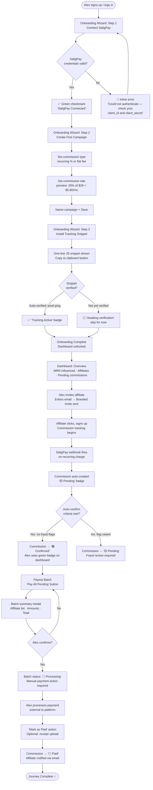
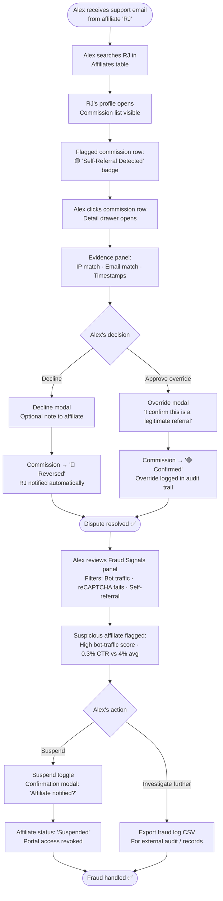
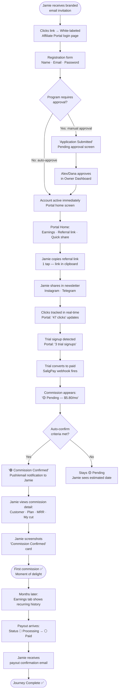
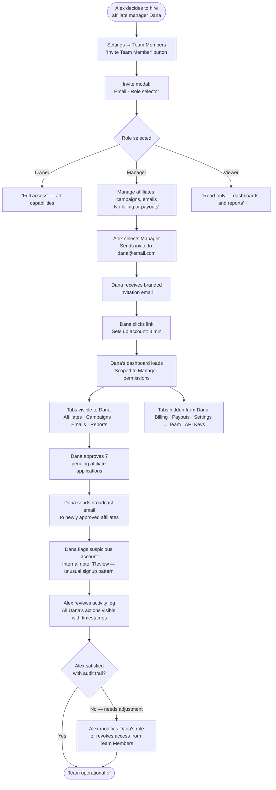

# UX Design Specification salig-affiliate

**Author:** msi
**Date:** 2026-03-10

---

<!-- UX design content will be appended sequentially through collaborative workflow steps -->

## Executive Summary

### Project Vision

salig-affiliate is a subscription-billing-first affiliate program management platform natively integrated with SaligPay. Unlike horizontal competitors (FirstPromoter, Rewardful, Tolt) that bolt onto billing stacks via third-party connectors, salig-affiliate is architecturally native to SaligPay — commission logic doesn't adapt to billing events, it IS billing events. The product gives SaaS owners a single dashboard to launch, manage, track, and pay affiliates, with deep SaligPay integration as the primary competitive moat.

Go-to-market: close functional clone of FirstPromoter, differentiated by native SaligPay integration, competitive PHP-first pricing, built-in email automation, and community-led growth via PH/SEA digital entrepreneur networks.

### Target Users

**Alex — SaaS Owner / Admin** _(paying customer)_
The Sunday-evening founder who connects SaligPay with a single API paste and needs confidence without complexity. Wants a dashboard that tells him exactly what's happening with his affiliate program — without requiring finance-brain. His aha moment: clicking "Pay All" and watching 47 payouts process while eating breakfast.

**Jamie — Affiliate / Promoter** _(non-paying, critical to Alex's retention)_
A Cebu-based newsletter writer, first-time affiliate. Her first 90 seconds on the portal determines whether she shares the referral link or ignores it forever. Needs to feel trusted and professionally welcomed — the portal must look like Alex's brand, not a generic SaaS tool. Her aha moment: the green "Commission Confirmed" badge she screenshots for her Telegram group.

**Dana — Manager** _(team member, scoped access)_
Approves affiliates, sends broadcast emails, flags suspicious accounts — never sees billing, never initiates payouts. Needs a clean, scoped interface where invisible access boundaries feel intentional, not broken.

**Sam — Platform Admin** _(internal ops)_
Surgical visibility: find tenant, impersonate, diagnose, resolve. Speed and auditability over aesthetics. The admin panel is a support instrument.

### Key Design Challenges

1. **Trust-First Affiliate Portal** — White-labeling is a first-impression conversion mechanism, not a cosmetic feature. Logo, colors, and domain must render the SaaS Owner's brand perfectly — never salig-affiliate's brand.

2. **Financial Clarity Without Finance Jargon** — Commission states (Pending → Confirmed → Reversed), payout statuses, and fraud signals must be instantly scannable. Status badges, color semantics, and progressive disclosure are critical tools.

3. **The Manual Payout Honesty UX** — MVP payouts are manually assisted. The UX must be honest about this without feeling janky: generate batch → download CSV → mark as paid → notify affiliates. Smooth enough Alex doesn't feel the absence of automation.

4. **Role-Based Interface Scoping** — Three roles with meaningfully different permission surfaces. The interface must feel intentionally scoped per role — Dana should never see a Payouts tab she can't click.

5. **Fraud Signals as Decision Prompts** — Fraud and commission review flows must turn raw signals into clear decision prompts: show evidence, offer action, log outcome — without burying Alex in technical noise.

### Design Opportunities

1. **Onboarding as Brand Promise Delivery** — A guided checklist with progress (SaligPay connect → create campaign → invite first affiliate, under 15 minutes) turns first-session activation into a word-of-mouth moment.

2. **The Affiliate Portal as a Trust Machine** — Designed with consumer-product care: clean stats, clear commission states, fast mobile load. Affiliate experience reflects directly on Alex's brand credibility.

3. **Dashboard as "Monday Morning Confidence"** — Answer Alex's three core weekly questions at a glance: How much revenue did affiliates drive? Any commissions to approve? Any payouts to run? That's the retention hook.

### Screen Inventory Approach

This UX spec will enumerate ALL screens across six distinct surfaces:

- **Surface 1:** SaaS Owner Dashboard (campaigns, affiliates, payouts, reporting, settings, team)
- **Surface 2:** Affiliate Portal (registration, login, dashboard, commissions, assets, profile)
- **Surface 3:** Platform Admin Panel (tenant list, detail, impersonation, config)
- **Surface 4:** Onboarding flows (signup, SaligPay connect, first campaign, first affiliate invite)
- **Surface 5:** Email templates (4 transactional + broadcast — designed affiliate-facing surfaces)
- **Surface 6:** Marketing Page (public-facing root route — hero, features, pricing, social proof, CTA)

Screen inventory will be cross-referenced against all 82 functional requirements to ensure complete coverage. Role-scoped screens will use Owner view as the canonical spec with Manager/Viewer variant annotations.

## Core User Experience

### Defining Experience

salig-affiliate's core experience revolves around two distinct heartbeat loops:

**For Alex (SaaS Owner):** The Monday morning check-in — open dashboard, scan program health, approve pending commissions, process payouts. Everything else is setup or configuration. The defining value proposition is that commissions appear automatically after SaligPay processes a payment — Alex never has to trigger this. He just opens the dashboard and the number is there.

**For Jamie (Affiliate):** The weekly portal check — open portal, see latest clicks and commissions, copy referral link to paste somewhere new. Simple, quick, confidence-building.

The make-or-break interaction is SaligPay connection setup. If Alex hits friction in the first API paste → connect flow, everything downstream fails. It must work the first time, confirm clearly, and reach first campaign creation in under 5 minutes.

### Platform Strategy

Web-first application with surface-specific device priorities:

- **SaaS Owner Dashboard:** Desktop-primary. Complex data tables, CSV exports, batch actions. Mobile is a "quick check" secondary use case.
- **Affiliate Portal:** Mobile-first. Jamie checks stats on her phone between tasks. Fast load, clean small-screen layout, one-tap referral link copy. WCAG 2.1 AA compliance required.
- **Platform Admin Panel:** Desktop-only. Sam is at a workstation when diagnosing tenant issues.
- **Onboarding:** Desktop-primary for SaaS Owner signup; mobile-aware for affiliate registration.
- **Email Templates:** Responsive HTML — rendered on any device in any email client.

No native mobile apps at MVP. No offline functionality required.

### Effortless Interactions

Interactions that must require zero cognitive load:

- Referral link copy — one click, confirmation toast, done
- Commission status at a glance — color-coded badges, no tooltips needed
- Payout batch generation — select affiliates, generate, download CSV (3 actions max)
- SaligPay reconnect — prominent, non-blocking prompt on token expiry
- Affiliate approval — single-action from the affiliate list, no deep navigation

Interactions that must be fully automatic (zero user action):

- Commission appearing after SaligPay billing event
- Commission reversal after refund/chargeback
- Affiliate welcome email on approval
- "Commission Confirmed" notification to affiliate

### Critical Success Moments

| Moment                                        | Who   | Significance                                              |
| --------------------------------------------- | ----- | --------------------------------------------------------- |
| SaligPay connects with green checkmark        | Alex  | First promise delivered — friction here = abandonment     |
| First referral appears in dashboard           | Alex  | The "it works" moment — must happen within 24hrs          |
| First "Commission Confirmed" badge            | Jamie | Trust established — she tells people about this           |
| Monday morning dashboard loads with real data | Alex  | Weekly retention hook — must answer 3 questions instantly |
| Payout batch processed without errors         | Alex  | Financial confidence — the recommendation moment          |
| Fraud caught automatically, no manual work    | Alex  | "Smarter than a spreadsheet" realization                  |

### Experience Principles

1. **"It just happened"** — The most important interactions occur without Alex or Jamie doing anything. Commissions appear. Notifications send. Reversals adjust. The product works in the background.

2. **"It's my brand, not yours"** — Every pixel Jamie sees reinforces trust in Alex's business, not salig-affiliate. White-labeling is the default. Our brand is invisible to affiliates.

3. **"Show me, don't explain me"** — Financial states, fraud signals, and commission history are visually self-explanatory. Color, iconography, and hierarchy carry the meaning. Tooltips are the fallback, not the primary communication.

4. **"Right access, right person"** — Every user sees exactly what they need and nothing they shouldn't. Scoped interfaces are confidence-builders. Dana never feels locked out — she simply doesn't see what isn't hers.

5. **"Honest about what it is"** — At MVP, payouts are manual-assisted. The UX never pretends otherwise. Clear, dignified language about the payout process builds trust. The workflow is frictionless even if it's not automated.

## Desired Emotional Response

### Primary Emotional Goals

**Alex (SaaS Owner):** "In command" — the primary emotion. Managing real money and other people's commissions demands a feeling of clear visibility and control. Secondary: quiet confidence that the system is doing the work accurately without requiring his constant attention.

**Jamie (Affiliate):** "Professional trust" — the portal must feel polished enough to signal that Alex takes his business seriously, because that reflects on her promotion efforts. Secondary: motivation — the dopamine hit of watching stats grow and commissions confirm.

**Dana (Manager):** "Clarity and focus" — empowered within her scope, never diminished. Her interface feels designed for her, not restricted from her.

**Sam (Platform Admin):** "Surgical efficiency" — find it fast, understand it instantly, fix it cleanly. The emotion after successful resolution: "Done. Next."

### Emotional Journey Mapping

**Alex's Emotional Arc:**

| Stage                      | Emotional State        | Design Response                                              |
| -------------------------- | ---------------------- | ------------------------------------------------------------ |
| Discovers product          | Cautious optimism      | Clean marketing-to-app continuity; no bait-and-switch        |
| SaligPay connects          | Relief + confidence    | Immediate green confirmation, clear next step                |
| First referral tracked     | Excitement             | Celebrate the first data point appearing                     |
| First payout processed     | Accomplishment + trust | Clear summary, confirmation emails sent, audit trail visible |
| Returns weekly             | Comfort + ownership    | Familiar dashboard that feels "his"                          |
| Fraud caught automatically | Impressed + relieved   | Evidence clearly surfaced; feels protected, not alarmed      |

**Jamie's Emotional Arc:**

| Stage                      | Emotional State              | Design Response                                |
| -------------------------- | ---------------------------- | ---------------------------------------------- |
| Receives invitation email  | Curious + slightly skeptical | Branded email earns trust immediately          |
| Registers on portal        | Welcome + ease               | Fast registration, immediate access            |
| Sees her stats             | Motivated + validated        | Clean numbers, positive framing                |
| First commission confirmed | Delighted + proud            | The screenshot moment — visually satisfying    |
| Checks portal regularly    | Habitual comfort             | Fast load, familiar layout, new data as reward |

### Micro-Emotions

- **Confidence over Confusion** — Every status, every action, every empty state communicates clearly. Never leave the user wondering "what does this mean?"
- **Trust over Skepticism** — Visual design reinforces precision: clean typography, accurate numbers, timestamps on every event.
- **Calm over Anxiety** — Even fraud alerts and stalled payouts are evidence-based and calm. "Here's what we found. Here's what you can do." Never red-flashing panic.
- **Accomplishment over Frustration** — Every completed action has a satisfying visual resolution. Close the loop on every interaction.
- **Belonging over Isolation** — For Jamie, the portal feels like hers: her stats, her links, her commissions. Personalized, not generic.

### Design Implications

| Desired Emotion                      | UX Design Approach                                                                        |
| ------------------------------------ | ----------------------------------------------------------------------------------------- |
| Alex feels "in command"              | Actionable data first; no buried stats; quick-action buttons at point of need             |
| Alex feels "system is accurate"      | Timestamps on every event; audit trail at one click; calculation formula visible on hover |
| Jamie feels "professional trust"     | Zero salig-affiliate branding; SaaS Owner logo prominent; domain reflects their brand     |
| Jamie feels "motivated"              | Real-time stat updates; "Commission Confirmed" as a celebratory micro-moment              |
| Dana feels "focused, not restricted" | Payouts tab simply absent — no locked icons, no greyed-out buttons                        |
| Sam feels "efficient"                | Power-user-density admin panel; impersonation clearly flagged; audit log filterable       |
| All users feel "calm" during errors  | Neutral language, clear cause, actionable next step — never blame language                |

### Emotions to Avoid

- **Anxiety** — unclear commission statuses create doubt about financial accuracy
- **Embarrassment** — a portal that looks unprofessional reflects on Jamie's credibility with her audience
- **Overwhelm** — too much data without hierarchy creates paralysis for Alex
- **Suspicion** — if the UI looks amateurish, Alex will doubt accuracy even when it's correct
- **Frustration** — any multi-step process that could be one step; any unnecessary confirmation modal

## UX Pattern Analysis & Inspiration

### Inspiring Products Analysis

**Linear — Sidebar Navigation & Status System**
Linear solves the emotional chaos of project management by making status immediately visible. Its persistent left sidebar with icon-first navigation, collapsible sections, and consistent status pill vocabulary (🔴 🟡 🟢 ⚪) trained an entire generation of SaaS users to expect visual clarity at a glance. For salig-affiliate, Linear is the reference point for the Owner Dashboard's sidebar architecture and the commission status badge system.

**Stripe — Financial Data at Human Scale**
Stripe's dashboard is the gold standard for making financial data emotionally digestible. The overview cards (MRR, active subscriptions, payout schedule) answer the user's primary questions before they scroll. The event timeline — timestamped, expandable, filterable — turns audit trails into stories. The dispute resolution workflow (evidence display → action button → outcome log) is the direct model for salig-affiliate's fraud review flow.

**Intercom — Impersonation Banner Pattern**
Intercom pioneered the persistent "You are impersonating [User]" banner that makes admin-mode unmistakably obvious without disrupting the underlying UI. This is the exact pattern salig-affiliate's Platform Admin needs when Sam enters a tenant's account for support.

**Notion — White-Label as First-Class Feature**
Notion's workspace customization (icon, cover, custom domain) demonstrates that making your brand disappear inside another product can itself be the product's value. For salig-affiliate's Affiliate Portal, Notion's brand-forward approach means the portal chrome shows Alex's logo, Alex's colors, Alex's domain — and salig-affiliate's identity is invisible.

**FirstPromoter — Campaign-Centric IA (Benchmark)**
FirstPromoter is the direct functional competitor. Its campaign-centric information architecture (campaign → affiliate list → individual affiliate detail) is the right mental model for salig-affiliate's Owner Dashboard. However, FirstPromoter's UI is visually dense and data-heavy without clear hierarchy. salig-affiliate improves on this with stronger visual hierarchy, cleaner empty states, and the status badge vocabulary.

### Transferable UX Patterns

**Navigation Patterns:**

- **Linear-style persistent sidebar** — fixed left nav with icon + label; collapsible on smaller screens; active section highlighted — maps directly to the Owner Dashboard's 6 primary sections (Overview, Affiliates, Commissions, Payouts, Campaigns, Settings)
- **Stripe-style overview cards** — scannable KPI strip at page top; 3–4 metrics; delta indicators (vs. last 30 days); no drilldown required for the weekly check-in

**Interaction Patterns:**

- **One-click referral link copy with toast confirmation** — addresses Jamie's #1 portal interaction; follows established clipboard copy patterns with a 2-second confirmation toast
- **Stripe-style event timeline** — commission events, payout events, and audit actions as a chronological feed with expandable rows — applicable to both Owner Dashboard activity feed and Affiliate Portal commission history
- **Batch action pattern** — checkbox-select affiliates, sticky action bar appears at bottom of table — applies to payout batch processing and affiliate bulk approval

**Visual Patterns:**

- **Status badge vocabulary** (established in Step 2): 🟡 Pending Review, 🟢 Confirmed, 🔴 Reversed, ⚪ Paid, 🔵 Processing — used consistently across Owner Dashboard and Affiliate Portal; color carries meaning without relying solely on color (icon + label)
- **Stripe-style empty states** — actionable, not apologetic; each empty state contains the primary action to resolve it ("No affiliates yet → Invite your first affiliate [button]")
- **Intercom impersonation banner** — persistent amber top bar with "Viewing as [Tenant Name]" + Exit button — Platform Admin panel only

### Anti-Patterns to Avoid

- **Locked/greyed-out navigation items for restricted roles** — Dana should not see a Payouts tab she can't use. Tabs simply don't appear for her role. "Visible but locked" creates frustration and implies she's missing something.
- **Notification overload on the affiliate portal** — Jamie's portal must stay clean and motivating. Generic SaaS notification patterns (red badge counters everywhere, system status banners) create anxiety. Only meaningful state changes get surfaced.
- **Multi-page wizard for payout processing** — The manual-assisted payout flow must compress into a single page flow: select affiliates → review totals → generate CSV → mark paid. Any more steps and it feels like a bureaucratic workaround.
- **Our brand in Jamie's portal** — salig-affiliate logo, colors, or "Powered by salig-affiliate" footer in a visually prominent position. At MVP, brand is present but minimal ("Powered by salig-affiliate" in footer only, subdued). The portal must reflect Alex's brand.
- **Error states without clear next action** — "Something went wrong" with no resolution path. Every error state includes: what happened, why it happened (if knowable), and what to do next.

### Design Inspiration Strategy

**Adopt Directly:**

- Linear sidebar nav architecture → Owner Dashboard primary navigation
- Stripe overview card layout → Owner Dashboard and Affiliate Portal stat strips
- Stripe event timeline → Commission history and activity feeds
- Intercom impersonation banner → Platform Admin tenant view
- Stripe dispute workflow → Fraud review and commission dispute flow

**Adapt for salig-affiliate's context:**

- Notion white-label philosophy → applied to portal chrome (not workspace customization — our white-label is brand/logo/color/domain, not workspace structure)
- FirstPromoter campaign-centric IA → keep the mental model, improve the visual hierarchy and empty states
- Batch action pattern from data tools → simplified for payout processing (less power-user, more guided flow)

**Avoid:**

- FirstPromoter's visual density without hierarchy
- Generic SaaS "locked feature" patterns for role scoping
- Multi-step wizard patterns for what should be single-page flows
- Any salig-affiliate brand prominence in the Affiliate Portal

## Design System Foundation

### Design System Choice

**Selected Approach: Themeable System — shadcn/ui + Tailwind CSS v3**

For salig-affiliate on Next.js, shadcn/ui with Tailwind CSS is the definitive choice. It is not a dependency — every component is copied into the codebase and owned outright. This is critical for a product with two visually distinct surfaces (Owner Dashboard and white-labeled Affiliate Portal), because design token switching at the CSS variable level is native to how shadcn/ui works.

**Key architectural principle:** Build the theming token system first. The Owner Dashboard uses Salig's own brand as the "default tenant theme." White-label is never retrofitted — it is the foundation everything inherits from.

### Rationale for Selection

- **White-label is a first-class requirement.** Affiliate Portal theming maps directly to Tailwind CSS custom properties and shadcn/ui's token system. Per-tenant theming is a runtime CSS variable swap — no component-level changes needed.
- **Next.js native.** shadcn/ui is built for Next.js App Router with Server Components. Zero friction, zero adapter layers.
- **Own the components.** Every component lives in `/components/ui/` and is fully modifiable. No fighting a library when the commission status badge needs a custom variant.
- **WCAG 2.1 AA out of the box.** Radix UI primitives (the headless foundation) have accessibility semantics built into every interactive component — critical for the mobile-first Affiliate Portal.
- **MVP timeline.** A team can be productive in shadcn/ui from day one.

### Design Token Architecture

Tokens are split into two layers to protect system semantics from tenant overrides:

**Layer 1 — Brand Tokens (tenant-overridable on Affiliate Portal):**

| Token                        | Salig Default             | Description                                      |
| ---------------------------- | ------------------------- | ------------------------------------------------ |
| `--brand-primary`            | `#10409a`                 | Header, sidebar, primary actions                 |
| `--brand-primary-foreground` | `#ffffff` (auto-computed) | Text on primary bg — white or dark per luminance |
| `--brand-secondary`          | `#1659d6`                 | CTA buttons, active states                       |
| `--brand-link`               | `#2b7bb9`                 | Hyperlinks, interactive text                     |
| `--brand-dark`               | `#022232`                 | Footer backgrounds, deep contrast                |
| `--font-sans`                | `Poppins`                 | Primary UI font — overridable in v2              |

**Layer 2 — Semantic Tokens (system-fixed, never tenant-overridable):**

| Token            | Value     | Usage                             |
| ---------------- | --------- | --------------------------------- |
| `--text-heading` | `#333333` | All headings                      |
| `--text-body`    | `#474747` | Body copy, table content          |
| `--bg-page`      | `#f2f2f2` | Page background                   |
| `--bg-surface`   | `#ffffff` | Cards, panels, modals             |
| `--destructive`  | `#EF4444` | Error states, destructive actions |
| `--warning`      | `#F59E0B` | Warning states                    |
| `--success`      | `#10B981` | Success states                    |
| `--muted`        | `#6B7280` | Subdued text, disabled states     |

**Status Badge Color Vocabulary** (semantic, maps to Layer 2 tokens):

| Status         | Token                     | Visual |
| -------------- | ------------------------- | ------ |
| Pending Review | `--warning` `#F59E0B`     | 🟡     |
| Confirmed      | `--success` `#10B981`     | 🟢     |
| Reversed       | `--destructive` `#EF4444` | 🔴     |
| Paid           | `--muted` `#6B7280`       | ⚪     |
| Processing     | `#3B82F6`                 | 🔵     |

**MVP Affiliate Portal Theming Contract:**

Alex provides two inputs. The system generates a complete branded portal:

| Input             | Token                        | Notes                                 |
| ----------------- | ---------------------------- | ------------------------------------- |
| Brand color (hex) | `--brand-primary`            | WCAG AA validated (≥4.5:1 on white)   |
| Auto-computed     | `--brand-primary-foreground` | White or `#1a1a1a` based on luminance |
| Logo image URL    | `--brand-logo-url`           | Displayed in portal header            |
| Custom domain     | DNS config                   | Infrastructure-level, not CSS         |

**WCAG validation rule:** If Alex's chosen color fails 4.5:1 contrast against `#ffffff`, the UI warns and suggests the nearest accessible shade before saving.

### Typography

- **Primary UI font:** `Poppins` via `next/font` (self-hosted, zero layout shift, preloaded) — weights 300, 400, 700, 900 — all UI text, labels, body, data tables
- **Display font:** `Passion One` via `next/font` — 400, 700, 900 — onboarding/marketing pages, empty state headlines only
- **Numeric rendering:** `font-variant-numeric: tabular-nums` on all currency and metric displays — commission amounts align on decimal points in tables without fixed-width columns

### Component Architecture

```
/components
  /ui          ← shadcn/ui primitives (Button, Table, Badge, Dialog, etc.)
  /shared      ← Cross-surface logic components (theme-aware, work on all surfaces)
  /dashboard   ← Owner Dashboard layout + composite components
  /portal      ← Affiliate Portal layout + composite components
  /admin       ← Platform Admin layout + composite components
```

**Key shared components to build custom:**

| Component             | Description                                                                                                                    |
| --------------------- | ------------------------------------------------------------------------------------------------------------------------------ |
| `StatusBadge`         | Commission/payout status — icon + label + semantic color. Accepts `showTimestamp` prop for timeline view vs. badge-only view   |
| `KpiCard`             | Metric card with value, label, and `trend` prop (up/down/neutral) — color-coded delta indicator for Alex's Monday morning scan |
| `ActivityTimeline`    | Chronological event feed with expandable rows — used in Owner Dashboard and Affiliate Portal                                   |
| `BatchActionBar`      | Sticky bottom bar appearing on table checkbox selection — payout and affiliate bulk actions                                    |
| `ImpersonationBanner` | Amber top bar for two contexts: (1) Platform Admin viewing a tenant, (2) SaaS Owner previewing their own affiliate portal      |
| `EmptyState`          | Actionable empty states with surface-specific primary CTA                                                                      |

### Customization Strategy

The Salig brand blue (`#10409a`) is the default `--brand-primary`. For the Affiliate Portal, `--brand-primary` becomes the tenant's validated brand color at runtime via `[data-tenant-theme]` attribute on `<html>`. The same `<Button variant="default">` renders blue on the Owner Dashboard and in the tenant's brand color on their affiliates' portal — zero conditional logic in the component.

**Build sequence:** Token system → Affiliate Portal (white-label validated) → Owner Dashboard (Salig brand as default tenant) → Admin Panel. This ensures white-label is structural, not cosmetic.

## Core User Experience — Defining Experience

### Defining Experience

salig-affiliate has two paired defining experiences — one for each primary user.
They are cause and effect.

**For Alex (SaaS Owner):** _"The commission appeared without me doing anything."_
Alex connects SaligPay, creates a campaign, and invites an affiliate. Days later, he opens his dashboard and finds a 🟢 Confirmed commission waiting — triggered automatically by a SaligPay billing event, calculated by the commission engine, and displayed without any manual intervention. This automatic appearance is the product's core promise. Every other feature — payouts, fraud detection, reporting — is downstream of this moment.

**For Jamie (Affiliate):** _"I saw my commission confirmed and I screenshotted it."_
Jamie promotes her referral link, then waits. When her commission transitions from 🟡 Pending Review to 🟢 Confirmed and she opens the portal to see that green badge alongside her name and amount — that's the moment she tells her audience about. That screenshot is salig-affiliate's word-of-mouth engine. It exists because Alex's defining experience worked.

### User Mental Model

**Alex's mental model** is shaped by payroll software and spreadsheets — he expects to manually track, verify, and trigger everything financial. salig-affiliate's job is to break that expectation pleasantly: the dashboard shows him outcomes, not tasks. His prior frustration with competitor tools (FirstPromoter, Rewardful) is manual syncing, connector failures, and commission miscalculations. His bar is: "just work, and show me proof it worked."

**Jamie's mental model** is shaped by influencer affiliate programs (Amazon Associates, ShareASale) — she expects a dashboard with a link, some stats, and eventually a payout. She brings healthy skepticism: "Is this real? Will I actually get paid?" The portal's job is to answer both questions visually and immediately, without asking her to read anything.

### Success Criteria

**Alex's core experience succeeds when:**

- First commission appears within 24 hours of first referred subscription — with zero manual action
- Commission status is readable in under 3 seconds (color + badge, no tooltip needed)
- The dashboard answers "how much did affiliates drive this month?" above the fold
- Payout batch can be initiated in under 3 clicks from the commissions view

**Jamie's core experience succeeds when:**

- Portal loads in under 2 seconds on mobile (3G conditions)
- Referral link is copyable in one tap with visible confirmation
- Commission status change (Pending → Confirmed) triggers a notification she actually opens
- The "Confirmed" state is visually satisfying enough to screenshot and share

### Novel vs. Established Patterns

salig-affiliate's core experience is built on **established patterns used with precision** — not novel interactions that require user education.

The defining innovation is not in the interaction design — it's in the _automatic triggering_. The UX pattern (dashboard cards, status badges, data tables, batch actions) is familiar SaaS vocabulary. What's new is that users encounter the output of these patterns without having to initiate the inputs. The commission is already there. The system already ran. The user arrives to results, not to a workflow.

This means: zero onboarding friction for the core loop. Alex and Jamie both already know how to read a dashboard and copy a link. The product's job is to populate those familiar patterns with accurate, timely data.

**Where we innovate within familiar patterns:**

- Status badge vocabulary (🟡🟢🔴⚪🔵) is consistent across both surfaces — Jamie and Alex see the same color semantics, building shared language
- Empty states are forward-looking ("Your first commission will appear here automatically after a referred customer subscribes") — not apologetic
- The payout flow is honest about its manual-assist nature while feeling as streamlined as possible: select → review → export → confirm

### Experience Mechanics

**The Automatic Commission Appearance (Alex's Defining Moment):**

1. **Initiation (zero user action):** SaligPay fires a billing event (subscription created / payment succeeded) to salig-affiliate's webhook
2. **Processing (zero user action):** Commission engine matches the event to an active campaign, calculates the commission amount, creates a commission record with status 🟡 Pending Review
3. **Feedback to Alex:** Commission row appears in the Commissions table on next dashboard load (or real-time if WebSocket/polling active). KPI card updates. Optional: email notification "New commission pending review — ₱1,250.00"
4. **Alex's action (optional):** Reviews and approves → status transitions to 🟢 Confirmed. If auto-approve is enabled for the campaign, this happens automatically.
5. **Completion:** Jamie receives a "Commission Confirmed" notification. Alex's dashboard shows updated totals. Audit trail logged.

**The Commission Confirmed Moment (Jamie's Defining Moment):**

1. **Initiation:** Alex approves (or auto-approve fires)
2. **Notification:** Jamie receives email + in-portal notification: "Your commission of ₱1,250.00 has been confirmed"
3. **Portal response:** Jamie opens portal → commission row shows 🟢 Confirmed badge with amount, date, and campaign name. Clean, uncluttered, satisfying.
4. **The screenshot:** The confirmed commission is visually prominent — large enough to be legible in a screenshot, branded with Alex's colors
5. **Completion:** Jamie copies her referral link again and promotes harder. The loop continues.

## Visual Design Foundation

### Color System

The color system is derived directly from the salig.ai brand identity and organized into three tiers: Brand Tokens (surface-level, tenant-overridable on the Affiliate Portal), Semantic Tokens (system-fixed, never overridden), and State Colors (status-specific, shared across all surfaces).

**Full Color Reference:**

| Name               | Hex                   | Tailwind Equivalent       | Usage                              |
| ------------------ | --------------------- | ------------------------- | ---------------------------------- |
| Brand Primary      | `#10409a`             | Custom                    | Sidebar, header, primary buttons   |
| Brand Secondary    | `#1659d6`             | Custom                    | CTAs, active nav, focus rings      |
| Brand Link         | `#2b7bb9`             | Custom                    | Inline links, interactive text     |
| Brand Dark         | `#022232`             | Custom                    | Footer bg, deep contrast panels    |
| Text Heading       | `#333333`             | `gray-800`                | H1–H4                              |
| Text Body          | `#474747`             | `gray-700`                | Paragraphs, table cells, labels    |
| Text Muted         | `#6B7280`             | `gray-500`                | Hints, placeholders, timestamps    |
| Surface White      | `#ffffff`             | `white`                   | Cards, modals, panels              |
| Page Background    | `#f2f2f2`             | `gray-100`                | Page canvas                        |
| Border             | `#e5e7eb`             | `gray-200`                | Dividers, card borders, table rows |
| Status: Pending    | `#F59E0B`             | `amber-500`               | 🟡 Pending Review badge            |
| Status: Confirmed  | `#10B981`             | `emerald-500`             | 🟢 Confirmed badge                 |
| Status: Reversed   | `#EF4444`             | `red-500`                 | 🔴 Reversed badge                  |
| Status: Paid       | `#6B7280`             | `gray-500`                | ⚪ Paid badge                      |
| Status: Processing | `#3B82F6`             | `blue-500`                | 🔵 Processing badge                |
| Destructive        | `#EF4444`             | `red-500`                 | Error states, delete actions       |
| Warning            | `#F59E0B`             | `amber-500`               | Caution alerts, fraud flags        |
| Success            | `#10B981`             | `emerald-500`             | Confirmations, completed states    |
| Impersonation      | `#FEF3C7` / `#92400E` | `amber-100` / `amber-800` | Admin impersonation banner bg/text |

**Dark mode:** Not in scope for MVP. Token architecture supports future dark mode via CSS variable inversion without component changes.

### Typography System

**Font Stack:**

| Role                 | Family                  | Weights            | Delivery                  |
| -------------------- | ----------------------- | ------------------ | ------------------------- |
| Primary UI           | `Poppins`               | 300, 400, 700, 900 | `next/font` (self-hosted) |
| Display / Onboarding | `Passion One`           | 400, 700, 900      | `next/font` (self-hosted) |
| Fallback             | `system-ui, sans-serif` | —                  | System default            |

_Both fonts loaded via `next/font` — zero layout shift, no external network request, preloaded on first paint._

**Type Scale:**

| Token       | Size | Weight | Line Height | Usage                             |
| ----------- | ---- | ------ | ----------- | --------------------------------- |
| `text-4xl`  | 36px | 900    | 1.2         | Page hero titles (onboarding)     |
| `text-3xl`  | 30px | 900    | 1.3         | Section headings (H1)             |
| `text-2xl`  | 24px | 700    | 1.35        | Card titles, modal headers (H2)   |
| `text-xl`   | 20px | 700    | 1.4         | Sub-section headings (H3)         |
| `text-lg`   | 18px | 600    | 1.45        | Emphasized body, table headers    |
| `text-base` | 16px | 400    | 1.5         | Body copy, form labels            |
| `text-sm`   | 14px | 400    | 1.5         | Secondary text, timestamps, hints |
| `text-xs`   | 12px | 400    | 1.4         | Badges, tags, footnotes           |

**Numeric rendering:** All currency amounts, commission figures, and KPI values use `font-variant-numeric: tabular-nums` — decimal alignment in tables without fixed-width columns.

### Spacing & Layout Foundation

**Base unit:** 4px. All spacing values are multiples of 4.

**Spacing Scale (Tailwind defaults apply):**

| Token      | Value | Usage                                    |
| ---------- | ----- | ---------------------------------------- |
| `space-1`  | 4px   | Icon-to-label gap, tight inline spacing  |
| `space-2`  | 8px   | Badge padding, compact row gaps          |
| `space-3`  | 12px  | Form field internal padding              |
| `space-4`  | 16px  | Card padding (mobile), section gaps      |
| `space-6`  | 24px  | Card padding (desktop), table row height |
| `space-8`  | 32px  | Section vertical rhythm                  |
| `space-12` | 48px  | Page section separators                  |
| `space-16` | 64px  | Hero padding, onboarding breathing room  |

**Layout Architecture:**

_Owner Dashboard (desktop-primary):_

- Fixed left sidebar: 240px wide, full viewport height
- Content area: fluid, min-width 768px
- Max content width: 1280px (centered on large screens)
- Sidebar collapses to icon-only at < 1024px viewport

_Affiliate Portal (mobile-first):_

- Single column layout, max-width 480px on mobile
- Centered with horizontal padding on tablet/desktop
- Sticky top header: 56px height, logo + minimal nav
- Bottom sheet pattern for actions on mobile

_Platform Admin (desktop-only):_

- Full-width table layout, no sidebar
- Dense information density — tighter spacing scale
- Minimum supported viewport: 1024px

**Border radius:**

- `rounded` (4px) — table rows, compact badges
- `rounded-md` (6px) — input fields, small cards
- `rounded-lg` (8px) — primary cards, modals, panels
- `rounded-full` — status badge pills, avatar circles

**Shadows:**

- `shadow-sm` — card resting state
- `shadow-md` — card hover, dropdown menus
- `shadow-lg` — modals, popovers

### Accessibility Considerations

**Contrast compliance (WCAG 2.1 AA):**

- All body text (`#474747` on `#ffffff`): 8.6:1 ✅
- Brand Primary (`#10409a`) as button bg with white text: 7.2:1 ✅
- Status: Pending (`#F59E0B`) used as background with dark text only — not white text
- Status colors never used as the _only_ differentiator — always paired with icon + label text

**Focus management:**

- All interactive elements have visible focus rings: `2px solid #1659d6`, `2px offset`
- Tab order follows visual reading order on all surfaces
- Modal dialogs trap focus correctly (Radix UI Dialog handles this)

**Motion:**

- Respects `prefers-reduced-motion` — all transitions disabled when set
- No auto-playing animations; no flashing content

**Tenant brand color validation:**

- When Alex sets a custom portal brand color, the system validates ≥ 4.5:1 contrast ratio against `#ffffff` before saving. If it fails, the nearest accessible shade is suggested and the color picker displays the contrast ratio live.

**Screen reader support:**

- Status badges include `aria-label` with full text status ("Commission confirmed")
- Data tables include `<caption>` and proper `<th scope>` attributes
- Toast notifications use `role="status"` with `aria-live="polite"`
- Impersonation banner uses `role="alert"` with `aria-live="assertive"`

---

## Design Direction Decision

**Selected Direction:** Hybrid — "Command Center" (D1) + "Affiliate-First Mobile" (D3)

**Codename:** _"Command & Convert"_

### The Strategic Logic

This combination acknowledges a fundamental truth about salig-affiliate: **it serves two completely different user contexts that must each feel native to how that user actually works.**

- **Alex and Dana** live on desktop, inside dashboards, managing programs across multiple affiliates. They need density, control, and information hierarchy. Direction 1's command-center ethos — sidebar navigation, data-table-first, metrics always visible — is exactly the professional authority they expect from a tool they're paying for.

- **Jamie** is on a phone, checking earnings between meetings, sharing a referral link from Instagram. Direction 3's mobile-first portal — large tap targets, bottom navigation, earnings front and center, one-tap share — is the difference between an affiliate who promotes actively and one who signs up and never returns.

**The white-label constraint amplifies this split**: Alex sees salig-affiliate's admin chrome; Jamie sees the _Owner's_ brand on the portal. These aren't two views of the same app — they're two intentionally different product surfaces that happen to share a backend.

### Design Principles Derived from This Decision

| Principle                                        | Expression                                                                                                                            |
| ------------------------------------------------ | ------------------------------------------------------------------------------------------------------------------------------------- |
| **Surface-specific density**                     | Owner Dashboard = information-dense, sidebar nav, desktop-optimized. Affiliate Portal = generous spacing, bottom nav, thumb-friendly. |
| **Role-appropriate defaults**                    | Every screen defaults to the mental model of its primary user — no compromise layouts.                                                |
| **One-tap to the moment that matters**           | Jamie's referral link is always ≤ 1 tap away. Alex's key metric (MRR influenced) is always above the fold.                            |
| **Mobile-first portal, desktop-first dashboard** | Breakpoint strategy diverges by surface, not unified.                                                                                 |
| **Command clarity over decoration**              | No gratuitous animation. Micro-interactions only where they confirm state (commission confirmed → badge pulses green).                |

### What We Are Explicitly NOT Doing

- ❌ No "responsive collapse" that turns the Owner Dashboard into a mediocre mobile experience — it's desktop-primary by design
- ❌ No whitespace-for-whitespace's-sake on the Affiliate Portal — mobile real estate is precious, used intentionally
- ❌ No decorative illustrations or "empty state art" — this is a professional tool, not a consumer app
- ❌ No animation that delays access to information

---

## User Journey Flows

### Journey 1: Alex — Setup to First Payout (Happy Path)

**Surface:** Owner Dashboard (desktop-primary)
**Goal:** Get from zero to a running affiliate program with paid commissions



**Flow Optimizations:**

- SaligPay connection is step 1 of onboarding — no way to proceed to campaign creation without it (prevents orphaned tenants)
- Commission preview (`20% of $29 = $5.80/mo`) is shown live as Alex types — reduces cognitive load during setup
- Snippet verification is non-blocking — Alex can skip and return; dashboard shows persistent "Tracking not verified" banner until resolved
- "Pay All Pending" is a single CTA — no hunting for individual commission rows

---

### Journey 2: Alex — Fraud Detection + Commission Dispute

**Surface:** Owner Dashboard (desktop-primary)
**Goal:** Detect fraud, take action, maintain commission ledger integrity



**Flow Optimizations:**

- Fraud flags surface at the commission row level — Alex never has to hunt for them in a separate menu
- Evidence panel is shown inline in a drawer, not a new page — no navigation loss
- Decline and Approve Override require a deliberate confirmation modal — no accidental irreversible actions
- Suspension confirms whether the affiliate will be notified, making it a conscious decision, not an invisible toggle

---

### Journey 3: Jamie — Affiliate Signup to Recurring Commission

**Surface:** Affiliate Portal (mobile-first)
**Goal:** Register, get link, share, and see commission confirmed



**Flow Optimizations:**

- Portal home shows earnings + referral link + share button in a single scroll — no sub-navigation needed to get started
- Referral link copy is a **single tap** — the most important action on the entire portal is the easiest
- Commission confirmed state triggers a push/email notification proactively — Jamie doesn't have to check the portal to know it worked
- "Commission Confirmed" card is designed to be screenshot-shareable (clean, branded, no clutter) — this is a viral sharing moment
- Pending commission shows estimated confirmation date — removes anxiety about "is this real?"

---

### Journey 4: Sam — Platform Admin Support Escalation

**Surface:** Platform Admin Panel (desktop-only)
**Goal:** Diagnose and resolve a tenant payout issue without engineering escalation

```mermaid
flowchart TD
    A([Support ticket received:\n'Payouts stuck for 3 affiliates']) --> B[Sam logs into\nAdmin Panel]
    B --> C[Tenant search:\nSearch by email / domain]
    C --> D[Tenant account detail:\nPlan · Affiliate count · Integration status]
    D --> E[Payout Batches tab:\nFriday's batch — 3x '🔵 Processing' stalled 48h]
    E --> F{Diagnosis needed}
    F -->|Impersonate to see what tenant sees| G[Impersonate action\n'You are now acting as Alex — all actions logged']
    G --> H[Impersonation banner:\n⚠️ 'Acting as: alex@saas.com — Exit any time']
    H --> I[Sam sees tenant dashboard\nintegration status shows '🔴 SaligPay disconnected']
    I --> J[Sam exits impersonation\nReturns to Admin view]
    J --> K[Sam triggers resolution email\n'SaligPay re-authentication required']
    K --> L[Admin note logged\n'Resolved: SaligPay key expired after password reset']
    L --> M[Ticket marked resolved\nin admin panel]
    M --> N[Plan limit check:\n940/1000 affiliates on Starter]
    N --> O[Sam adds account flag:\n'Approaching plan limit — upsell opportunity']
    O --> P([Support resolved in 11 min ✅])
```



**Flow Optimizations:**

- Impersonation is a deliberate, prominent action — requires a confirmation click with clear audit warning
- Impersonation banner is **always visible** during the session and cannot be dismissed — Sam can never forget she's impersonating
- All impersonation actions are logged with: `[Sam] [impersonating: alex@saas.com] [action] [timestamp]`
- Exit impersonation is accessible from the persistent banner — one click, no navigation required
- Plan limit alert is surfaced on the account detail page, not in a separate report — Sam catches it passively

---

### Journey 5: Alex — Team Member Invite + RBAC

**Surface:** Owner Dashboard (desktop-primary)
**Goal:** Delegate affiliate management without exposing financial controls



**Flow Optimizations:**

- Role selector shows a plain-language capability summary inline — Alex doesn't need to read documentation to understand what "Manager" means
- Restricted tabs are **hidden**, not grayed out — Dana never sees options she can't use; no "access denied" friction
- Activity log is accessible to Alex from the Team Members settings — one click, full audit history per team member
- Role change and access revocation are available from the same Team Members screen — no hunting through settings

---

### Journey Patterns

Across all 5 flows, these recurring patterns have been identified and standardized:

**Navigation Patterns:**

- **Drawer over new page:** Detail views (commission detail, affiliate profile, fraud evidence) open in side drawers — preserves list context, faster than full navigation
- **Persistent action banner:** High-stakes persistent states (impersonation, tracking not verified, SaligPay disconnected) use a top banner that cannot be dismissed until the state resolves
- **Breadcrumb-free depth:** Navigation depth is capped at 2 levels (List → Detail drawer) — breadcrumbs not needed

**Decision Patterns:**

- **Deliberate confirmation for irreversible actions:** Decline commission, suspend affiliate, impersonate, and mark-as-paid all require a confirmation modal with consequence summary
- **Inline evidence before decision:** Fraud review, dispute resolution — evidence is shown _before_ the action buttons, not after
- **Role-gated visibility (hide, don't disable):** Unauthorized actions are not shown, not grayed out

**Feedback Patterns:**

- **Proactive notification on key state changes:** Commission confirmed → Jamie gets notified without polling
- **Live preview for configuration:** Commission rate entry shows a dollar example in real-time ("20% of $29 = $5.80/mo")
- **Status badge vocabulary is consistent across all surfaces:** 🟡 Pending, 🟢 Confirmed, 🔴 Reversed, ⚪ Paid, 🔵 Processing — same color, same label, everywhere

---

### Flow Optimization Principles

| Principle                                       | Implementation                                                                                                                     |
| ----------------------------------------------- | ---------------------------------------------------------------------------------------------------------------------------------- |
| **Minimize steps to first value**               | SaligPay connection → campaign → snippet: 3 steps, ~10 minutes, program is live                                                    |
| **Surface the moment that matters**             | Commission Confirmed badge is the emotional peak of both Alex's and Jamie's journeys — visually prominent and proactively notified |
| **Make the critical action the easiest action** | Copy referral link = 1 tap on mobile. Pay All Pending = 1 CTA on dashboard                                                         |
| **Evidence before action**                      | No irreversible decision (decline, suspend, impersonate) without showing the context that justifies it                             |
| **Scope by role, hide by permission**           | Dana's dashboard shows only what she can act on — no access-denied walls                                                           |
| **Audit everything that matters**               | Impersonation, commission overrides, role changes, payout marks — all logged with actor + timestamp                                |

---

## Component Strategy

### Design System Components (shadcn/ui — Available Out of the Box)

These shadcn/ui primitives cover foundational needs with zero custom work:

| Component             | Used For                                                                               |
| --------------------- | -------------------------------------------------------------------------------------- |
| `Button`              | All CTAs — Pay All Pending, Invite, Approve, Suspend, Copy Link                        |
| `Dialog`              | Confirmation modals — Decline commission, Suspend affiliate, Impersonate, Mark as Paid |
| `Sheet` (side drawer) | Detail drawers — Commission detail, Affiliate profile, Fraud evidence panel            |
| `Table`               | Affiliates list, Commissions list, Payout batches, Fraud signals                       |
| `Input` / `Form`      | Campaign creation, Team invite, Registration, Settings                                 |
| `Select`              | Role selector (Owner / Manager / Viewer), commission type selector                     |
| `Tabs`                | Owner Dashboard navigation (Affiliates / Campaigns / Payouts / Reports)                |
| `Badge`               | Status badges — Pending / Confirmed / Reversed / Paid / Processing                     |
| `Toast`               | Action confirmations — "Commission declined", "Invite sent", "Batch created"           |
| `Dropdown Menu`       | Row-level actions — Approve, Decline, Suspend, Export                                  |
| `Avatar`              | Affiliate list, Team members                                                           |
| `Separator`           | Section dividers in drawers and modals                                                 |
| `Switch`              | Affiliate suspension toggle, campaign active/inactive toggle                           |
| `Tooltip`             | Metric explanations, truncated text, fraud score labels                                |
| `Skeleton`            | Loading states for all data tables and metric cards                                    |

---

### Custom Components

These components do not exist in shadcn/ui and are critical to the product's unique UX.

---

#### 1. `StatusBadge`

**Purpose:** Unified commission/payout status indicator used across every surface — Owner Dashboard, Affiliate Portal, Admin Panel. The single most repeated visual element in the product.

**Usage:** Every commission row, payout batch row, affiliate row status column

**Anatomy:**

- Colored dot (8px circle) + label text
- Semantic color tokens (not emoji in production)

**States / Variants:**

| Variant      | Color           | Label      | Use                              |
| ------------ | --------------- | ---------- | -------------------------------- |
| `pending`    | `#F59E0B` amber | Pending    | Commission awaiting confirmation |
| `confirmed`  | `#10B981` green | Confirmed  | Commission auto-confirmed        |
| `reversed`   | `#EF4444` red   | Reversed   | Commission declined/reversed     |
| `paid`       | `#6B7280` gray  | Paid       | Payout completed                 |
| `processing` | `#3B82F6` blue  | Processing | Payout batch in progress         |
| `flagged`    | `#F59E0B` amber | Flagged    | Self-referral / fraud hold       |
| `suspended`  | `#EF4444` red   | Suspended  | Affiliate account suspended      |
| `active`     | `#10B981` green | Active     | Affiliate/campaign active        |

**Accessibility:** Each badge renders with `aria-label="Status: Confirmed"` — color is never the only differentiator; text label is always present.

**Pulse animation:** On `confirmed` state transition (pending→confirmed), the badge pulses once with a 300ms scale animation, respecting `prefers-reduced-motion`.

---

#### 2. `MetricCard`

**Purpose:** Primary KPI display unit on the Owner Dashboard. Shows a headline number with context — trend, comparison period, delta.

**Usage:** Dashboard overview — MRR Influenced, Active Affiliates, Pending Commissions, Total Paid Out

**Anatomy:**

- Label (e.g., "MRR Influenced")
- Primary value (e.g., "$3,400")
- Delta indicator — arrow up/down + percentage + "vs last month" text
- Sparkline (optional, v1.1)

**States:**

- `loading` — skeleton placeholder
- `default` — value populated
- `positive-trend` — green delta indicator
- `negative-trend` — red delta indicator
- `neutral` — gray delta indicator (no change)

**Variants:** `sm` (compact, 4-up grid) / `lg` (featured metric, full-width)

**Accessibility:** `role="region"` with `aria-label="MRR Influenced: $3,400, up 12% from last month"`

---

#### 3. `ReferralLinkCard`

**Purpose:** The most important element on the Affiliate Portal — Jamie's referral link with one-tap copy and share actions. Mobile-optimized.

**Usage:** Affiliate Portal home screen, top of earnings view

**Anatomy:**

- Label: "Your Referral Link"
- Link display (truncated with ellipsis on mobile)
- Copy button (primary, full-width on mobile)
- Share button (secondary, opens native share sheet on mobile / clipboard on desktop)
- Custom vanity link option (expandable)

**States:**

- `default` — link shown, copy ready
- `copied` — "Copied!" confirmation state, 2 seconds, then resets
- `sharing` — native share sheet triggered

**Interaction:** Copy tap → immediate "Copied!" state change → haptic feedback on mobile (if supported) → resets after 2s.

**Accessibility:** Copy button `aria-label="Copy referral link to clipboard"`. After copy: `aria-live="polite"` announces "Link copied."

---

#### 4. `CommissionConfirmedCard`

**Purpose:** The hero moment in Jamie's journey — the "Commission Confirmed" display designed to be screenshot-shareable. Brand-forward, clean, no chrome.

**Usage:** Commission detail view in Affiliate Portal when status = confirmed

**Anatomy:**

- Owner's brand logo (white-label)
- "Commission Confirmed ✓" headline
- Customer plan + MRR amount
- Jamie's commission amount (large, prominent)
- "Recurring — every month" sub-label
- Date confirmed

**Design requirement:** This card renders cleanly even when screenshotted — no navigation chrome, no truncation, no overflow. It IS the share moment.

**States:** Only rendered when status = `confirmed` — not shown for pending or reversed commissions.

---

#### 5. `PersistentAlertBanner`

**Purpose:** System-level alerts that must not be dismissable until the underlying state is resolved.

**Usage:**

- Impersonation active: `⚠️ Acting as alex@saas.com — all actions are logged. [Exit Impersonation]`
- Tracking not verified: `⚠️ Tracking snippet not yet verified. [View Setup Guide]`
- SaligPay disconnected: `🔴 SaligPay connection lost. [Reconnect]`

**Anatomy:**

- Icon (warning / error)
- Message text
- Inline action link
- Color: warning = amber background / error = red background

**Behavior:**

- Stacks below the top navigation bar, pushes page content down (not an overlay)
- Disappears automatically when underlying state resolves
- Cannot be dismissed by user

**Accessibility:** `role="alert"` with `aria-live="assertive"` for impersonation. `role="status"` with `aria-live="polite"` for warnings.

---

#### 6. `OnboardingProgress`

**Purpose:** 3-step progress indicator for Alex's initial setup flow. Communicates completion state and navigability between steps.

**Usage:** Onboarding wizard — Connect SaligPay → Create Campaign → Install Snippet

**Anatomy:**

- Numbered step indicators (1, 2, 3)
- Step label text
- Connector lines between steps
- State per step: `completed` (checkmark) / `active` (filled) / `pending` (outline)

**Behavior:**

- Completed steps are clickable (return to edit)
- Active step is current
- Pending steps are not clickable until prior steps complete (snippet step is skippable)

**Accessibility:** `role="list"` with each step as `role="listitem"`, `aria-current="step"` on active step.

---

#### 7. `AffiliateApprovalRow`

**Purpose:** Specialized table row for the affiliate approval queue — actionable inline, no drawer required for quick approve/reject decisions.

**Usage:** Affiliates → Pending Applications tab

**Anatomy:**

- Avatar + Name + Email
- Applied date
- Source (how they found the program)
- Inline action buttons: `[Approve]` `[Reject]`
- Expandable: click row to see full application details

**States:**

- `pending` — approve/reject actions visible
- `approving` — loading state on approve button
- `approved` — row collapses with success flash
- `rejected` — row collapses with dismissal

**Keyboard:** Tab through rows, Enter to expand, keyboard-accessible approve/reject buttons.

---

#### 8. `PayoutBatchSummary`

**Purpose:** The confirmation modal content before Alex executes a payout batch. Shows the full picture before an irreversible action.

**Usage:** "Pay All Pending" confirmation modal

**Anatomy:**

- Total amount (large, prominent)
- Affiliate count
- Scrollable list of affiliates + individual amounts
- Warning: "This marks commissions as paid. Ensure you've transferred funds externally."
- `[Confirm & Mark as Paid]` / `[Cancel]` actions

**States:**

- `preview` — data shown, confirm available
- `confirming` — button loading state
- `success` — modal closes, toast fires

---

#### 9. `WhiteLabelPortalShell`

**Purpose:** The outer shell of the Affiliate Portal that renders the SaaS Owner's brand — not salig-affiliate's brand. Every Jamie sees her owner's logo, colors, and domain.

**Usage:** All Affiliate Portal pages

**Anatomy:**

- Top bar: Owner logo + program name
- Bottom navigation bar (mobile): Home / Earnings / Links / Account
- Page content area
- No salig-affiliate brand marks anywhere

**Theming:** Accepts `brandColor`, `logoUrl`, `programName` from tenant config. Brand color is validated for WCAG 4.5:1 contrast before render.

**Desktop:** Sidebar navigation replaces bottom nav above `lg` breakpoint.

---

### Component Implementation Strategy

**Principle:** Build on shadcn/ui primitives wherever possible. Custom components are thin wrappers or compositions — they use the same design tokens and never introduce parallel token systems.

| Layer                  | Components                                                                           | Approach                                                      |
| ---------------------- | ------------------------------------------------------------------------------------ | ------------------------------------------------------------- |
| **Primitives**         | Button, Input, Dialog, Sheet, Table, Badge, Toast, Select                            | Use shadcn/ui as-is; apply brand tokens via CSS variables     |
| **Compositions**       | StatusBadge, MetricCard, AffiliateApprovalRow, PayoutBatchSummary                    | Compose from primitives + custom styles                       |
| **Feature components** | ReferralLinkCard, CommissionConfirmedCard, OnboardingProgress, WhiteLabelPortalShell | Purpose-built; use primitive atoms internally                 |
| **Layout components**  | PersistentAlertBanner, WhiteLabelPortalShell                                         | Structural; manage z-index, stacking, and responsive behavior |

**File structure:**

```
components/
  ui/                     ← shadcn/ui primitives (auto-generated, don't edit)
  shared/
    StatusBadge.tsx
    MetricCard.tsx
    PersistentAlertBanner.tsx
  dashboard/              ← Owner Dashboard-specific
    AffiliateApprovalRow.tsx
    PayoutBatchSummary.tsx
    OnboardingProgress.tsx
  portal/                 ← Affiliate Portal-specific
    ReferralLinkCard.tsx
    CommissionConfirmedCard.tsx
    WhiteLabelPortalShell.tsx
```

---

### Implementation Roadmap

**Phase 1 — Critical Path (MVP launch blockers)**

| Component               | Blocks Journey                                 | Priority |
| ----------------------- | ---------------------------------------------- | -------- |
| `StatusBadge`           | J1, J2, J3, J4 — appears on every data surface | 🔴 P0    |
| `WhiteLabelPortalShell` | J3 — Jamie can't access portal without this    | 🔴 P0    |
| `ReferralLinkCard`      | J3 — Jamie's #1 action on the portal           | 🔴 P0    |
| `OnboardingProgress`    | J1 — Alex's setup flow                         | 🔴 P0    |
| `PersistentAlertBanner` | J4, J1 — impersonation + SaligPay disconnect   | 🔴 P0    |

**Phase 2 — Core Experience (MVP completeness)**

| Component                 | Blocks Journey                                       | Priority |
| ------------------------- | ---------------------------------------------------- | -------- |
| `MetricCard`              | J1 — Dashboard overview is Alex's daily view         | 🟠 P1    |
| `AffiliateApprovalRow`    | J2, J5 — Affiliate management flow                   | 🟠 P1    |
| `PayoutBatchSummary`      | J1 — Payout execution is the revenue-enabling moment | 🟠 P1    |
| `CommissionConfirmedCard` | J3 — The viral sharing moment                        | 🟠 P1    |

**Phase 3 — Delight & Optimization (post-MVP polish)**

| Component                   | Enhancement                         | Priority |
| --------------------------- | ----------------------------------- | -------- |
| `MetricCard` sparkline      | J1 — Trend visualization over time  | 🟡 P2    |
| Vanity link builder         | J3 — Custom referral link slugs     | 🟡 P2    |
| Fraud evidence panel (rich) | J2 — Richer IP/device visualization | 🟡 P2    |

---

## UX Consistency Patterns

### Button Hierarchy

Every surface in salig-affiliate uses a strict 3-level button hierarchy. No surface should ever have two primary buttons competing for attention.

| Level           | shadcn/ui Variant | Visual                     | When to Use                                                                                                                        |
| --------------- | ----------------- | -------------------------- | ---------------------------------------------------------------------------------------------------------------------------------- |
| **Primary**     | `default`         | Solid brand blue `#10409a` | The single most important action per view. One per screen section max.                                                             |
| **Secondary**   | `outline`         | Border + transparent bg    | Supporting actions alongside a primary. Cancel, Edit, Export.                                                                      |
| **Ghost**       | `ghost`           | No border, text only       | Low-emphasis tertiary actions. View details, Skip, Learn more.                                                                     |
| **Destructive** | `destructive`     | Red background             | Irreversible destructive actions only. Suspend, Delete, Revoke. Always in a confirmation modal — never exposed directly in a list. |

**Rules:**

- **One primary CTA per screen section** — "Pay All Pending", "Create Campaign", "Copy Link" are never competing with another primary
- **Destructive actions are never primary-styled in lists** — they live behind a dropdown or drawer action, surfaced only in confirmation modals
- **Loading state:** all buttons show a spinner replacing the label text during async operations — never just disable without feedback
- **Full-width on mobile** for primary actions in the Affiliate Portal — thumb-friendly tap targets minimum 44px height

---

### Feedback Patterns

**Toast notifications** (non-blocking, bottom-right on desktop, bottom-center on mobile):

| Situation           | Toast Style  | Message Pattern                  | Duration                      |
| ------------------- | ------------ | -------------------------------- | ----------------------------- |
| Success             | Green border | "[Action] successful."           | 3s auto-dismiss               |
| Info                | Blue border  | Neutral information              | 4s auto-dismiss               |
| Warning             | Amber border | Requires attention, not blocking | 5s persistent until dismissed |
| Error (recoverable) | Red border   | "[Action] failed. [Retry link]"  | Persistent until dismissed    |

**Inline validation** (forms):

- Errors appear **below the field** that failed, not at top of form
- Validation fires **on blur** (when user leaves a field), not on every keystroke — avoids premature error nagging
- Success state: subtle green border on field after valid input (only for fields where correctness is non-obvious, e.g., SaligPay credentials)
- Error message text is always **actionable**: "Enter a valid email address" not "Invalid email"

**Confirmation modals** (irreversible actions):

- Title: states the consequence, not the action — "Decline this commission?" not "Are you sure?"
- Body: shows what will happen and to whom — "RJ will be notified. This cannot be undone."
- Buttons: `[Confirm: Decline Commission]` (destructive) + `[Cancel]` (ghost) — the confirm button names the action, never just "Yes" or "OK"
- Default focus is on **Cancel**, not the destructive action — requires deliberate tab/click to confirm

**Empty states:**

- Always include: what's missing + why + one action to fix it
- Pattern: `[Icon] [Headline: "No affiliates yet"] [Body: "Invite your first affiliate to start tracking commissions."] [Primary CTA: "Invite Affiliate"]`
- No decorative illustrations — icon + text only (consistent with "Command & Convert" direction)

---

### Form Patterns

**Field layout:**

- Labels always **above** the field — never placeholder-as-label (placeholders disappear on focus, causing cognitive load)
- Required fields are unmarked — optional fields are marked with `(optional)` suffix in the label
- Help text appears below the label in muted gray (`#6B7280`) when needed — not as placeholder text

**Multi-step forms (Onboarding Wizard):**

- Progress shown via `OnboardingProgress` component — user always knows where they are
- Each step validates before advancing — no silent forward navigation with errors
- Back navigation always available — no data loss when going back
- "Skip for now" only on truly optional steps (snippet verification)

**Settings forms:**

- Auto-save is **not used** — changes require an explicit "Save" action
- Unsaved changes are tracked; navigating away shows a browser confirmation dialog
- Save button is disabled until at least one field has changed

**Commission rate input:**

- Live preview shown inline: `20% → "$5.80/mo on a $29 plan"` — computed from the most common plan price in the tenant's SaligPay data
- Rate limits: 1%–100% for percentage; min $1 for flat fee — validated with clear boundary messages

---

### Navigation Patterns

**Owner Dashboard (desktop sidebar navigation):**

- Sidebar is fixed, 240px wide, always visible at `lg` and above
- Active section highlighted with left border accent (`#10409a`) + label bold
- Section order: Overview → Affiliates → Campaigns → Commissions → Payouts → Reports → Settings
- Role-scoped visibility: Manager sees no Payouts or Settings (billing/team); Viewer sees no action items
- Sections never collapse to icons-only — label is always visible (no icon-only nav that requires tooltip literacy)

**Affiliate Portal (mobile bottom navigation):**

- 4 tabs: Home / Earnings / Links / Account
- Active tab: filled icon + label in brand color (owner's `brandColor`)
- Bottom nav is persistent — never hidden on scroll
- On desktop (`lg+`): bottom nav becomes left sidebar, same 4 sections

**Drawer navigation:**

- All detail views (commission detail, affiliate profile, fraud evidence) open as right-side `Sheet` drawers
- Drawer width: 480px on desktop, full-width on mobile
- Drawer does not push content — it overlays with a backdrop
- Esc key and backdrop click both close the drawer
- Drawers do not nest — opening a second action from within a drawer uses a modal, not a second drawer

**Breadcrumbs:** Not used. Navigation depth is capped at 2 levels (list → detail drawer). The sidebar/bottom nav always shows the current section.

---

### Modal and Overlay Patterns

**Modal hierarchy:**

- `Dialog` (shadcn/ui) for all confirmation modals and data-entry modals
- `Sheet` (shadcn/ui) for all detail drawers — right-anchored
- `PersistentAlertBanner` for non-dismissable system state alerts
- `Toast` for transient feedback

**Modal sizing:**

- Confirmation modals: `sm` (max 400px) — focused, no distraction
- Data-entry modals (invite, campaign create): `md` (max 560px)
- PayoutBatchSummary: `lg` (max 640px) with internal scroll for long affiliate lists

**Stacking rules:**

- No drawer inside a drawer — use a modal for secondary actions from within a drawer
- Toast appears above drawers and modals (z-index hierarchy: page → drawer → modal → toast → banner)
- `PersistentAlertBanner` is always topmost — sits above the nav bar, never obscured

**Focus management:**

- Modal opens: focus moves to first interactive element (usually Cancel button for destructive modals)
- Modal closes: focus returns to the element that triggered it
- All modals trap focus (handled by Radix UI via shadcn/ui)

---

### Search and Filtering Patterns

**Table search:**

- Search input is always the first element above a data table — not inside a dropdown
- Search is **instant** (debounced 300ms) — no submit button
- Search applies client-side when table is paginated locally; server-side for large datasets
- Placeholder text names the searchable fields: "Search by name, email, or referral code"

**Table filtering:**

- Filters are shown as pill buttons above the table (not hidden in a filter drawer) for ≤4 filter options
- For >4 options: a "Filter" button opens a dropdown with checkboxes
- Active filters show a count badge: "Status (2)"
- "Clear all filters" link appears only when at least one filter is active

**Table sorting:**

- Column headers are clickable for sortable columns — chevron icon indicates sort direction
- Default sort for commissions: `_creationTime` descending (most recent first)
- Default sort for affiliates: `_creationTime` descending (newest first)
- Sort state persists within a session, resets on navigation

**Pagination:**

- Cursor-based (Convex `paginate`) — no page numbers, just "Load more" button at table bottom
- "Load more" shows remaining count: "Load 20 more (143 remaining)"
- No infinite scroll — explicit user action prevents accidental data loading

---

### Loading and Skeleton Patterns

**Skeleton loading** (preferred over spinners for content areas):

- Data tables: skeleton rows match the approximate column widths of real data
- MetricCard: skeleton shows the card shell with animated shimmer
- Affiliate Portal home: skeleton for earnings number + referral link card

**Inline loading** (for actions, not page loads):

- Button spinner: replaces button label text during async operations
- Row-level: `AffiliateApprovalRow` shows spinner on the Approve button while the mutation is in flight
- Never show a full-page spinner for row-level actions

**Error states (data fetch failures):**

- Pattern: `[Error icon] [Message: "Couldn't load commissions"] [Retry button]`
- Retry button re-triggers the Convex query — no page reload required
- Partial failures (one metric card fails) don't block the rest of the dashboard — each card handles its own error state independently

---

### Data Table Patterns

All data tables across the product share these conventions:

**Column standards:**

- First column: primary identifier (name + avatar, or ID) — always visible, never truncated
- Status column: always uses `StatusBadge` — never raw text
- Amount columns: right-aligned, monospace font for number alignment
- Date columns: relative time for recent dates ("3 days ago"), absolute date on hover tooltip ("Mar 7, 2026")
- Actions column: always rightmost, shows dropdown `...` menu for row actions

**Row interaction:**

- Clickable rows open a detail drawer (Sheet) — not a new page
- Hover state: subtle row background highlight `#f9fafb`
- Row selection (for bulk actions like payout batches): checkbox in first column, bulk action bar appears at table top when ≥1 row selected

**Bulk actions:**

- Bulk action bar floats above the table when rows are selected: "[N] selected · [Approve All] [Export] [Clear selection]"
- Bulk destructive actions (e.g., bulk suspend) require a confirmation modal showing affected count

---

## Responsive Design & Accessibility

### Responsive Strategy

salig-affiliate's "Command & Convert" design direction makes a deliberate architectural choice: **breakpoint strategy is surface-specific, not unified.** The Owner Dashboard and Affiliate Portal have different primary devices, different users, and different information needs. A single responsive system that serves both equally would serve neither well.

| Surface                  | Primary Device                   | Strategy                                                                                                                                 |
| ------------------------ | -------------------------------- | ---------------------------------------------------------------------------------------------------------------------------------------- |
| **Owner Dashboard**      | Desktop (1280px+)                | Desktop-first. Information-dense sidebar layout is the designed experience. Mobile is a read-only degraded view, not a full feature set. |
| **Affiliate Portal**     | Mobile (375px–767px)             | Mobile-first. Every layout decision starts at 375px and scales up gracefully. Desktop is a comfortable scale-up, not a redesign.         |
| **Platform Admin Panel** | Desktop only (1024px+)           | Desktop-only. No mobile support required or designed. Admin work is operational and demands screen real estate.                          |
| **Onboarding flows**     | Desktop-primary, tablet-friendly | Alex sets up his program on a laptop. Forms are comfortable at 768px+.                                                                   |
| **Email templates**      | Mobile-first                     | Most email is opened on mobile. Templates are single-column, large text, single CTA.                                                     |

---

### Breakpoint Strategy

Using Tailwind CSS v3 default breakpoints — aligned with shadcn/ui's internal assumptions:

| Breakpoint | Min Width | Alias       | Usage                                                                                               |
| ---------- | --------- | ----------- | --------------------------------------------------------------------------------------------------- |
| Default    | 0px       | (none)      | Mobile base styles — Affiliate Portal primary design                                                |
| `sm`       | 640px     | Small       | Larger phones, compact tablets                                                                      |
| `md`       | 768px     | Medium      | Tablets, small laptops — onboarding forms comfortable here                                          |
| `lg`       | 1024px    | Large       | **Critical breakpoint** — sidebar nav appears, bottom nav disappears on Portal; Admin Panel minimum |
| `xl`       | 1280px    | Extra Large | **Owner Dashboard primary** — full sidebar + data table layout                                      |
| `2xl`      | 1536px    | 2X Large    | Wide desktop — MetricCards expand to 4-up grid, tables show more columns                            |

**Critical breakpoint behaviors:**

**Affiliate Portal at `lg` (1024px+):**

- Bottom navigation → left sidebar (4 items, same structure)
- Single-column card layout → 2-column grid for earnings summary
- `ReferralLinkCard` stays prominent above the fold

**Owner Dashboard below `lg` (< 1024px):**

- Sidebar collapses to hamburger menu (Sheet drawer)
- Data tables show reduced columns — name + status + amount only; full row opens drawer for the rest
- MetricCards stack to 2-up grid instead of 4-up
- "Pay All Pending" and primary CTAs remain accessible — not hidden behind menus
- **Important:** this is a degraded experience by design — Alex is not expected to manage his program from a phone. The mobile view is read-only friendly but not action-optimized.

**Owner Dashboard at `2xl` (1536px+):**

- Sidebar expands to 280px with section descriptions
- Data tables show all columns without truncation
- MetricCards: 4-up grid with sparkline slots visible

---

### Accessibility Strategy

**Target compliance: WCAG 2.1 Level AA** — the industry standard established as the baseline in the Visual Design Foundation section. This section defines the **implementation mechanics** surface by surface.

**Why AA and not AAA:** The product serves professional SaaS operators (Alex, Dana) and content creators (Jamie) — not a public-sector or medically critical application. AA is the right investment level: meaningful inclusivity without disproportionate implementation cost. Specific AAA criteria would be addressed case-by-case where they apply naturally.

**Surface-specific accessibility considerations:**

**Owner Dashboard:**

- Dense data tables require full keyboard navigation: Tab to table, arrow keys between rows, Enter to open drawer, Escape to close
- Sort controls on column headers: keyboard-activatable with `Space`/`Enter`, announces sort direction changes via `aria-live`
- Bulk selection: `Space` to toggle row selection, `Shift+Space` for range selection
- Commission status changes triggered by Convex real-time subscriptions announce via `aria-live="polite"` — screen reader users hear "Commission confirmed" without page refresh

**Affiliate Portal:**

- Touch targets: minimum 44×44px for all interactive elements — enforced via Tailwind `min-h-11 min-w-11` utility
- `ReferralLinkCard` copy action: single tap target (no double-tap ambiguity), confirmed via `aria-live` announcement
- Bottom navigation: `role="navigation"` with `aria-label="Main navigation"`, active tab has `aria-current="page"`
- `CommissionConfirmedCard`: all content readable without color — amount and status are text, not color-only signals

**Platform Admin Panel:**

- Impersonation banner: `role="alert"` with `aria-live="assertive"` — immediately announced when impersonation begins
- All admin actions (impersonate, add note, mark resolved) are keyboard-accessible
- Tenant search: announces result count on completion — "3 tenants found"

**White-label color validation:**

- When Alex sets a custom `brandColor` for the portal, the system validates contrast ratio live in the color picker
- If `brandColor` fails 4.5:1 against `#ffffff`, the picker shows: "This color doesn't meet accessibility standards. Suggested accessible shade: [darker variant]"
- The system auto-suggests the nearest darker shade that passes — Alex can accept it or override with acknowledgment

---

### Testing Strategy

**Responsive testing:**

| Test Type            | Method                                                     | Frequency                        |
| -------------------- | ---------------------------------------------------------- | -------------------------------- |
| Device simulation    | Chrome DevTools device emulation — all primary breakpoints | Every PR                         |
| Real device — mobile | iPhone SE (375px) + standard Android (390px)               | Weekly during active development |
| Real device — tablet | iPad (768px)                                               | Pre-release                      |
| Cross-browser        | Chrome, Firefox, Safari, Edge — latest 2 versions          | Pre-release                      |
| Network throttling   | Slow 3G simulation for Affiliate Portal (Jamie's context)  | Pre-release                      |

**Accessibility testing:**

| Test Type                  | Tool / Method                                                                  | Frequency                   |
| -------------------------- | ------------------------------------------------------------------------------ | --------------------------- |
| Automated scan             | `axe-core` via `@axe-core/react` in development — violations logged to console | Every development session   |
| CI accessibility gate      | `axe` Playwright integration — fails PR if new violations introduced           | Every PR                    |
| Keyboard-only navigation   | Manual walkthrough of all 5 user journeys using keyboard only                  | Pre-release                 |
| Screen reader — macOS      | VoiceOver + Safari — Affiliate Portal and Owner Dashboard critical paths       | Pre-release                 |
| Screen reader — Windows    | NVDA + Firefox — Owner Dashboard data tables                                   | Pre-release                 |
| Color blindness simulation | Chrome DevTools "Emulate vision deficiencies" — all 8 types                    | Pre-release                 |
| Reduced motion             | `prefers-reduced-motion` forced on — verify all animations disabled            | Every PR touching animation |
| Contrast audit             | `axe` + manual check for custom colors (especially tenant brand colors)        | Pre-release                 |

**User testing:**

- Recruit at least 1 screen reader user in the first round of beta testing
- Test Affiliate Portal with actual Filipino mobile users (target: mid-range Android, ~390px, potentially slower connections)
- Validate `CommissionConfirmedCard` screenshot legibility on a range of actual device screens

---

### Implementation Guidelines

**Responsive development:**

```tsx
// Tailwind mobile-first pattern — Affiliate Portal
<div className="
  flex flex-col gap-4
  md:flex-row md:gap-6
  lg:grid lg:grid-cols-3
">
```

- Always write mobile styles first (no prefix), then add `md:`, `lg:`, `xl:` overrides
- Use `rem` units for spacing and typography — never `px` for font sizes
- Images: use `next/image` with `sizes` prop matching breakpoint strategy — never load a 1280px image on a 375px screen
- SVG icons: always include `aria-hidden="true"` when decorative; `aria-label` when meaningful

**Accessibility development:**

```tsx
// Correct StatusBadge pattern
<span className="inline-flex items-center gap-1.5" aria-label={`Status: ${statusLabel}`}>
  <span className="h-2 w-2 rounded-full bg-green-500" aria-hidden="true" />
  <span className="text-sm font-medium">{statusLabel}</span>
</span>
```

- **Semantic HTML first:** use `<button>` not `<div onClick>`, `<nav>` not `<div>`, `<table>` not CSS grid for tabular data
- **Focus rings:** never remove `outline` without providing a visible alternative — use `focus-visible:ring-2 focus-visible:ring-brand-primary` via Tailwind
- **Skip link:** implement `<a href="#main-content" className="sr-only focus:not-sr-only">Skip to main content</a>` as first element in `layout.tsx` for both Dashboard and Portal
- **Form errors:** use `aria-describedby` to associate error messages with their fields
- **Dynamic content:** wrap Convex real-time data updates in `aria-live="polite"` regions — commission status changes, click counters, earnings updates

**Performance (affects accessibility for low-bandwidth users):**

- Affiliate Portal target: ≤ 200KB initial JS bundle — Jamie on a mobile connection in Cebu cannot wait 5 seconds for the portal to load
- Use Next.js `dynamic()` imports to code-split Owner Dashboard features not needed on portal routes
- Convex queries are reactive by default — no polling needed, which also reduces battery drain on mobile

---

## Surface 6: Marketing Page

### Purpose & Strategic Role

The marketing page is the **public front door of salig-affiliate**. It is the first thing a prospective SaaS Owner (Alex) sees before he has any reason to trust the product. The page ships alongside the MVP and is a **must-have capability** — without it, community-led acquisition from PH/SEA networks has no landing destination.

**Referential benchmark:** [firstpromoter.com](https://firstpromoter.com/) — the direct competitor and the mental model most prospects already carry. The marketing page should be immediately legible to anyone who has seen FirstPromoter: same genre, different (better) story.

**Primary conversion goal:** One action — **"Start your free trial"** (14 days, no credit card required). Every section exists to remove objections and build confidence toward that click.

---

### Design Direction

**"Confident and Direct"** — not minimal-trendy, not feature-list-overwhelming. The page communicates authority through clarity. A SaaS founder landing here should feel: _"This product understands my problem."_

Design principles specific to the marketing page:

| Principle                                                      | Expression                                                                                                                                        |
| -------------------------------------------------------------- | ------------------------------------------------------------------------------------------------------------------------------------------------- |
| **Lead with the outcome, not the feature**                     | Hero says what Alex gets ("Run a real affiliate program — without the spreadsheet") not what the product does ("An affiliate tracking platform")  |
| **Native SaligPay integration is the headline differentiator** | This is the moat. It should appear in the hero sub-headline and the features section — not buried                                                 |
| **Pricing is not a trap**                                      | Prices are displayed openly. No "Contact us for pricing." PH/SEA founders have been burned by opaque SaaS pricing. Transparency is a trust signal |
| **Social proof fills trust gaps**                              | At launch, use founder quotes or early adopter testimonials. Placeholder content is acceptable for day-1 launch, replaced within 30 days          |
| **Marketing-to-app continuity**                                | Brand colors, typography, and visual language carry from the marketing page into the app — no bait-and-switch on design quality                   |

---

### Page Architecture

The marketing page is a **single scrollable page** at the root route (`/`). No sub-pages required at MVP.

**Section order (top to bottom):**

| #   | Section                          | Primary Goal                                                                               |
| --- | -------------------------------- | ------------------------------------------------------------------------------------------ |
| 1   | **Navigation Header**            | Orient + convert (Login / Start trial)                                                     |
| 2   | **Hero**                         | Capture attention, communicate core value, drive primary CTA                               |
| 3   | **Social Proof Bar**             | Establish trust immediately below the fold (logos or stats)                                |
| 4   | **Problem Statement**            | Resonate with the pain — "managing affiliates in a spreadsheet is costing you commissions" |
| 5   | **Features**                     | Show what makes salig-affiliate the right solution (6 core capabilities)                   |
| 6   | **SaligPay Integration Callout** | Dedicated moat section — the native integration advantage                                  |
| 7   | **How It Works**                 | 3-step visual flow: Connect → Track → Pay                                                  |
| 8   | **Pricing**                      | 3 tiers, transparent, with "Start free trial" CTA per tier                                 |
| 9   | **Testimonials / Social Proof**  | Specific, human, result-oriented quotes                                                    |
| 10  | **Final CTA**                    | Repeated primary CTA with urgency copy                                                     |
| 11  | **Footer**                       | Links, legal, minimal                                                                      |

---

### Section-by-Section Spec

#### 1. Navigation Header

**Layout:** Sticky top bar, full width, `bg-white` with `shadow-sm` on scroll

**Contents (left to right):**

- salig-affiliate logo (wordmark + mark) — left-aligned
- Nav links (desktop only): Features · Pricing · (Blog — v2) — center or left
- Right side: `[Log In]` (ghost button) + `[Start free trial →]` (primary button, `bg-brand-primary #10409a`)

**Mobile:** Logo left, hamburger menu right — no center nav. Sheet drawer opens with links + both CTAs stacked.

**Scroll behavior:** Header becomes sticky with subtle shadow after 64px scroll. Primary CTA remains visible at all scroll depths on mobile (sticky bottom bar pattern as a fallback if conversion data warrants it — v1.1 option).

---

#### 2. Hero Section

**Goal:** One headline, one sub-headline, one CTA, one supporting visual. Nothing else.

**Layout:** Two-column on desktop (copy left, visual right), single column on mobile (copy top, visual bottom).

**Headline (Passion One, 48px / 36px mobile, `#333333`):**

> "The affiliate program your SaaS actually needs."

_(Alt: "Stop tracking commissions in a spreadsheet." — A/B test candidate)_

**Sub-headline (Poppins, 20px / 16px mobile, `#474747`):**

> "salig-affiliate connects natively to SaligPay — so every recurring charge, upgrade, and refund updates your affiliates' commissions automatically. No connectors. No manual work."

**Primary CTA:**

> `[Start your free trial →]` — large primary button (`h-12`, `px-8`), `bg-brand-primary #10409a`, white text
> Sub-copy below button: _"14 days free · No credit card required"_ (muted text, `text-sm`, `#6B7280`)

**Visual (right column / below on mobile):**

- Dashboard screenshot or clean mockup showing the commissions overview with 🟢 Confirmed badges
- Framed in a subtle browser chrome or floating card — not raw screenshot
- Alt text: "salig-affiliate dashboard showing confirmed affiliate commissions"

**Background:** `#f2f2f2` page background or subtle gradient from white to `#f2f2f2` — no dark hero at MVP

---

#### 3. Social Proof Bar

**Goal:** One sentence of validation before the user has to scroll far.

**Layout:** Centered, full-width horizontal bar with `border-y border-gray-200` and `bg-white`.

**Content options (prioritized):**

_Option A (if customer logos available):_

> "Trusted by SaaS founders on SaligPay" + 3–5 customer logos (grayscale)

_Option B (launch default — stats/copy):_

> Three stat pills side by side:
> — "14-day free trial · No card required"
> — "Native SaligPay integration"
> — "Set up in under 15 minutes"

_Replace with real logos/stats within 30 days of launch._

---

#### 4. Problem Statement

**Goal:** Make Alex feel understood before showing him the solution.

**Layout:** Centered, single column, max-width 680px, generous vertical padding.

**Headline (Poppins 700, 28px):**

> "Managing affiliate commissions manually is costing you — and your affiliates."

**Body copy (3 short paragraphs or a 4-item pain list):**

- Every plan upgrade your affiliate referred? Manual commission adjustment.
- Referral link click → paid customer → how long does that take to show up in your tool? Days. Sometimes never.
- Refund hits. Do you remember to reverse the commission? Probably not.
- Every competitor you've looked at requires a webhook you have to maintain yourself.

**Design note:** This section uses body copy only — no UI components, no icons. The emotional register is quiet and direct. Alex should nod while reading this, not scan it.

---

#### 5. Features Section

**Goal:** Show the 6 core platform capabilities in a scannable, visually organized grid.

**Layout:** 3-column grid on desktop, 2-column on tablet, 1-column on mobile. Each feature is a card: icon (24px, brand color) + title + 1–2 sentence description.

**6 Feature Cards:**

| Icon | Title                           | Description                                                                                                                                                                     |
| ---- | ------------------------------- | ------------------------------------------------------------------------------------------------------------------------------------------------------------------------------- |
| ⚡   | **Native SaligPay Integration** | Zero webhook setup. Connect with your SaligPay API key and every billing event — new charges, upgrades, refunds — automatically triggers commission logic.                      |
| 🔄   | **Recurring Commission Engine** | Commissions aren't a one-time event. Every renewal, every upgrade, every chargeback — handled automatically. Your commission ledger stays accurate without manual intervention. |
| 🎨   | **Branded Affiliate Portal**    | Your affiliates see your logo, your colors, your domain — not ours. The portal is white-labeled from day one, so Jamie promotes with confidence.                                |
| 💸   | **Payout Workflow**             | Generate a payout batch, download a CSV, mark as paid. Your affiliates get notified automatically. No spreadsheet. No chasing.                                                  |
| 🛡️   | **Fraud Detection**             | Self-referral detection, reCAPTCHA bot protection, IP deduplication, and a fraud signals panel. Commission accuracy is protected — automatically.                               |
| 📊   | **Real-Time Reporting**         | Overview, campaign performance, affiliate performance — with date range filtering and CSV export. Answer "how much did affiliates drive this month?" in under 3 seconds.        |

**Visual treatment:** Cards use `bg-white`, `rounded-lg`, `shadow-sm`, `p-6`. Icon uses brand color `#10409a`. Title is `text-xl font-700`. Description is `text-base text-body`.

---

#### 6. SaligPay Integration Callout

**Goal:** This is the moat. Give it its own dedicated section — don't let it get lost in the features grid.

**Layout:** Full-width, `bg-brand-dark #022232` background, white text — a visual break that signals importance.

**Headline (Passion One, white, 36px):**

> "Built natively on SaligPay. Not bolted on."

**Body:**

> Every other affiliate tool in the market connects to your billing via a third-party webhook. That means connector lag, reliability risk, and an integration you own.
>
> salig-affiliate is different. It reads your SaligPay billing events directly — new charges, recurring billing, upgrades, cancellations, refunds, chargebacks. Commission logic runs the moment billing happens. Not eventually. Not manually.

**Supporting detail (3-column icon row, white/muted):**

- "Zero setup — paste your API key, done"
- "Every billing event handled: 7 event types"
- "Commission accuracy: 99.99% target"

**CTA (secondary, white outline button):**

> `[Start your free trial →]`

---

#### 7. How It Works

**Goal:** Make the setup journey feel simple and fast — 3 steps.

**Layout:** Horizontal step flow on desktop (numbered 1→2→3 with connector lines), vertical on mobile.

**Steps:**

**1. Connect SaligPay**

> Paste your SaligPay API key. That's the entire setup. No webhooks. No developer required. You're connected.

**2. Create a Campaign & Invite Affiliates**

> Set your commission structure — percentage or flat fee, one-time or recurring. Generate referral links. Invite your first affiliate in 30 seconds.

**3. Track, Pay, Grow**

> Watch commissions appear automatically as SaligPay processes payments. Run a payout batch when you're ready. Your affiliates get notified. Your program runs itself.

**Visual:** Simple numbered step illustration or a condensed screenshot per step (single row of cards, minimal decoration).

---

#### 8. Pricing Section

**Goal:** Full transparency. No games. Remove the "I need to sign up just to see prices" objection.

**Layout:** 3-column card grid on desktop, stacked on mobile. Middle card (Growth) is visually elevated — "Most Popular" badge.

**Pricing cards spec:**

| Tier                        | Price     | Affiliates  | Campaigns | Key Differentiators                                        | CTA                  |
| --------------------------- | --------- | ----------- | --------- | ---------------------------------------------------------- | -------------------- |
| **Starter**                 | ₱1,999/mo | Up to 1,000 | Up to 3   | Core tracking, manual payouts, standard emails             | `[Start free trial]` |
| **Growth** _(Most Popular)_ | ₱4,499/mo | Up to 5,000 | Up to 10  | Priority support, advanced reports, custom email templates | `[Start free trial]` |
| **Scale**                   | ₱8,999/mo | Unlimited   | Unlimited | Custom domain + SSL, CSV export, API access (v2)           | `[Start free trial]` |

**Annual pricing toggle:** Add a "Monthly / Annual" toggle above the cards. Annual shows "Save 17%" badge on each card. Annual pricing = monthly price × 10 (2 months free).

**Sub-copy below cards:**

> "All plans include a 14-day free trial with full Scale tier access. No credit card required."

**Enterprise callout (below cards):**

> Need custom limits or pricing? [Talk to us →] (mailto or Calendly link)

**Card design:** `bg-white`, `rounded-lg`, `shadow-sm` for Starter/Scale. Growth card: `bg-brand-primary #10409a`, white text, `shadow-lg` — elevated and visually prominent.

---

#### 9. Testimonials

**Goal:** Specific, human, result-oriented. "It worked for someone like me."

**Layout:** 2-column grid on desktop, single column on mobile. Each testimonial is a quote card.

**Quote card anatomy:**

- Quote text (italic, `text-lg`, `#333333`)
- Name + title + company (small, bold name, muted title)
- Optional: avatar (circle, 40px)

**Launch content:**

> Use founder/early adopter quotes if available. If not, seed with 2 realistic placeholder quotes in the correct format and replace within 30 days:
>
> _"Set up my affiliate program in 12 minutes. It tracked a plan upgrade I would have missed manually. Paid 6 affiliates before my coffee was done."_
> — Alex R., SaaS founder, Philippines
>
> _"I've been an affiliate for 3 programs. Most portals feel like they were designed in 2012. This one actually looked like a real product — I trusted it immediately."_
> — Jamie L., Newsletter creator, Cebu

**Note:** Replace placeholders with verified quotes before any paid advertising or press coverage.

---

#### 10. Final CTA Section

**Goal:** A second conversion moment for visitors who scrolled the whole page but haven't clicked yet.

**Layout:** Centered, full-width, `bg-brand-primary #10409a` background, white text.

**Headline (Passion One, white, 36px):**

> "Your affiliate program is 15 minutes away."

**Sub-copy:**

> 14-day free trial. Full Scale tier access. No credit card required.

**CTA button (white background, brand text color):**

> `[Start your free trial →]`

---

#### 11. Footer

**Layout:** 4-column grid on desktop, 2-column on tablet, stacked on mobile. `bg-brand-dark #022232`, white/muted text.

**Column 1:** salig-affiliate logo + 1-sentence product description + "Built on SaligPay"

**Column 2:** Product links — Features · Pricing · Log In · Sign Up

**Column 3:** Company links — About (v2) · Blog (v2) · Contact

**Column 4:** Legal links — Privacy Policy · Terms of Service · Cookie Policy

**Bottom bar:** `© 2026 salig-affiliate. All rights reserved.` — centered, `text-xs text-muted`

**"Powered by" note:** _Not_ present in footer at MVP. salig-affiliate markets itself, not its infrastructure stack.

---

### Responsive Behavior

| Breakpoint            | Behavior                                                                                                                                           |
| --------------------- | -------------------------------------------------------------------------------------------------------------------------------------------------- |
| Mobile (< 640px)      | Single column layout throughout. Hero copy stacks above visual. Features grid 1-column. Pricing cards stacked. Bottom nav CTA bar optional (v1.1). |
| Tablet (640px–1023px) | 2-column features grid. Pricing cards 2-column + 1 below or full-width. Hero 2-column.                                                             |
| Desktop (1024px+)     | Full 3-column grids. Side-by-side hero. Sticky header with all nav links.                                                                          |

**Performance target:** Marketing page initial JS bundle ≤ 150KB. Images served via `next/image` with WebP format and breakpoint-optimized `sizes`. Hero screenshot/mockup lazy-loaded below the CTA fold.

---

### SEO Requirements

| Tag                         | Content                                                                                                                                                             |
| --------------------------- | ------------------------------------------------------------------------------------------------------------------------------------------------------------------- |
| `<title>`                   | "salig-affiliate — Affiliate Program Management for SaaS on SaligPay"                                                                                               |
| `<meta name="description">` | "Launch, manage, and pay your affiliate program natively on SaligPay. Automatic commission tracking, branded affiliate portal, fraud detection. 14-day free trial." |
| Open Graph `og:title`       | "salig-affiliate — Affiliate Program Management for SaaS"                                                                                                           |
| Open Graph `og:description` | Same as meta description                                                                                                                                            |
| Open Graph `og:image`       | Dashboard screenshot social card (1200×630px)                                                                                                                       |
| `<h1>`                      | Hero headline (only one `<h1>` per page)                                                                                                                            |
| Canonical URL               | `https://saligaffiliate.com/`                                                                                                                                       |

**Implementation:** All metadata defined in Next.js `generateMetadata()` export in `app/page.tsx` (Server Component).

---

### Component Reuse

The marketing page reuses design tokens from the core system but uses **minimal custom components** — it is not part of the app shell and should not inherit app-level layout components.

| Need                | Component                                                        |
| ------------------- | ---------------------------------------------------------------- |
| Primary CTA buttons | shadcn/ui `Button` with `variant="default"` — brand tokens apply |
| Pricing cards       | Custom `PricingCard` component (marketing-only)                  |
| Feature cards       | Custom `FeatureCard` component (marketing-only)                  |
| Testimonial cards   | Custom `TestimonialCard` component (marketing-only)              |
| Navigation header   | Custom `MarketingNav` component (separate from `AppNav`)         |
| Footer              | Custom `MarketingFooter` component                               |

**File location:**

```
app/
  page.tsx                  ← Marketing page (Server Component, root route)
  (marketing)/
    _components/
      MarketingNav.tsx
      MarketingFooter.tsx
      HeroSection.tsx
      FeaturesSection.tsx
      SaligPayCallout.tsx
      HowItWorksSection.tsx
      PricingSection.tsx
      PricingCard.tsx
      TestimonialsSection.tsx
      FinalCTASection.tsx
```

**Route group:** Use `(marketing)` route group to isolate marketing layout from `(app)` layout — the marketing page does NOT use the authenticated app shell (no sidebar, no top bar, no session context required).

---

### Analytics & Conversion Tracking (MVP)

At MVP, instrument the following events for conversion analysis:

| Event                | Location                       | Purpose                   |
| -------------------- | ------------------------------ | ------------------------- |
| `cta_click`          | All "Start free trial" buttons | Primary conversion signal |
| `pricing_tier_click` | Per-tier CTA button            | Which tier converts best  |
| `annual_toggle`      | Pricing toggle                 | Annual plan interest      |
| `page_scroll_depth`  | 25% / 50% / 75% / 100%         | Content engagement        |

**Implementation:** Use `next/script` with a lightweight analytics provider (e.g., Plausible or PostHog) — no Google Analytics bloat at MVP. Script loads with `strategy="lazyOnload"` to avoid blocking first paint.
