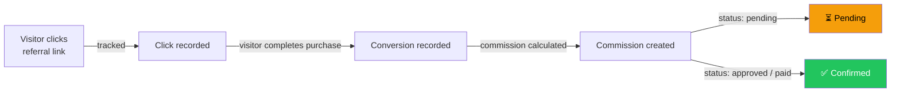
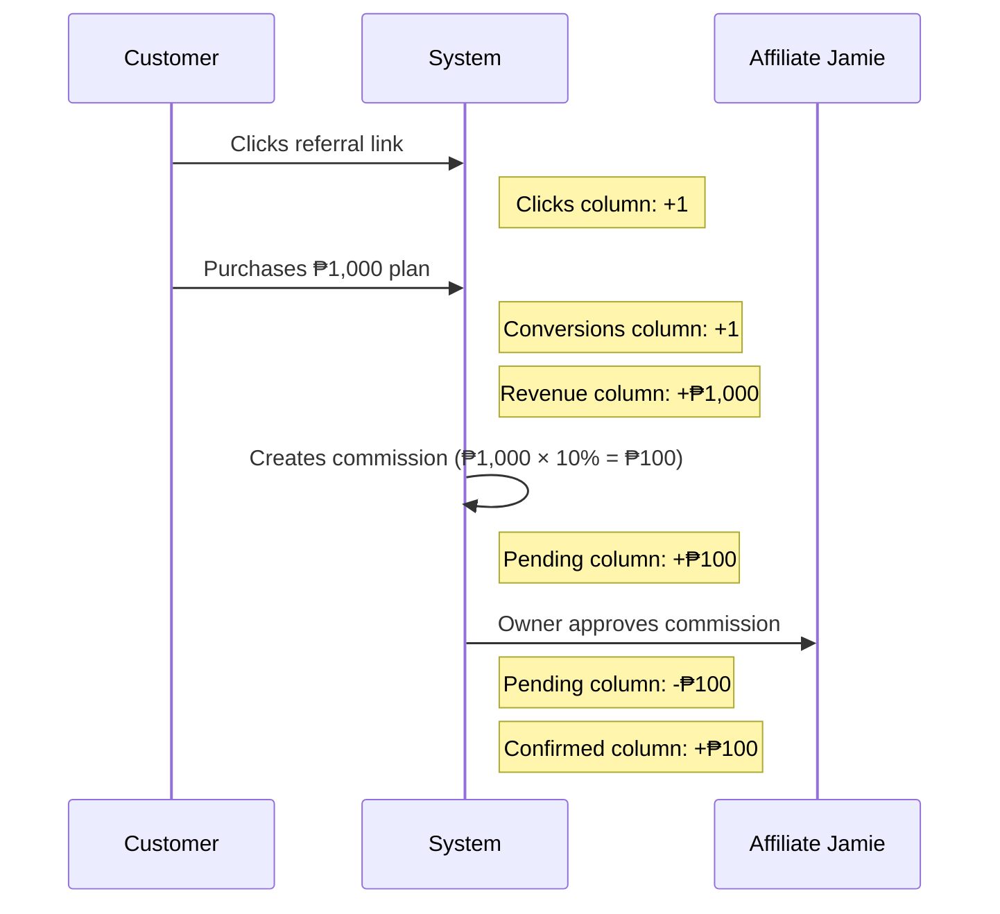
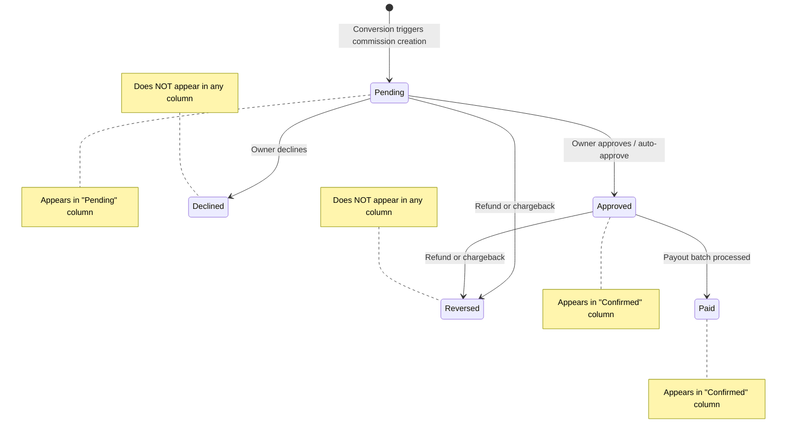
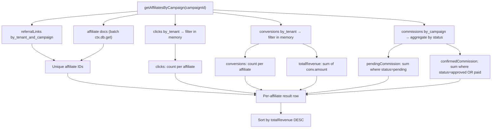

# Affiliates Table — Column Reference

> Use this reference to interpret affiliate performance data in the campaign table, diagnose low-converting affiliates, and understand how commissions flow from click to payout.

**Related:** See [Commission Lifecycle](commission-lifecycle.md) for the full status flow from creation to payout.

## Table Location

- **Page:** `Campaigns → [Campaign Name] → Affiliates` section
- **Component:** `src/components/dashboard/AffiliatesByCampaignTable.tsx`
- **Data source:** `api.campaigns.getAffiliatesByCampaign` query in `convex/campaigns.ts`

## Column Summary

| Column | Header | Source Table | Aggregation | Display Format |
|--------|--------|-------------|-------------|----------------|
| `affiliate` | Affiliate | `affiliates` | N/A (identity) | Avatar + name + email |
| `joinedAt` | Joined | `affiliates._creationTime` | N/A | Short date |
| `clicks` | Clicks | `clicks` | Count | Number |
| `conversions` | Conversions | `conversions` | Count | Number |
| `totalRevenue` | Revenue | `conversions.amount` | Sum | Currency (₱) |
| `pendingCommission` | Pending | `commissions.amount` | Sum (where `status=pending`) | Currency (₱), muted |
| `confirmedCommission` | Confirmed | `commissions.amount` | Sum (where `status=approved` or `status=paid`) | Currency (₱) |

## The Affiliate Funnel

Each column represents a stage in the affiliate conversion funnel. A visitor starts by clicking a link, may convert to a paying customer, and generates a commission that flows from pending to confirmed:

## Column Details

### Clicks

Tracks how many times visitors clicked the affiliate's referral link for this campaign.

- **Source table:** `clicks`
- **Filter:** `campaignId` matches the current campaign, `affiliateId` matches the row's affiliate
- **Computation:** `count` — one `clicks` document per click event
- **Purpose:** Measures raw traffic volume. Use this alongside conversions to gauge affiliate link quality.

**What creates a click:** When a visitor clicks a referral link, the system records the click with the visitor's IP address, user agent, and a deduplication key. See [Click Tracking](click-tracking.md) for details.

### Conversions

Counts how many referred visitors completed a purchase or signup for this campaign.

- **Source table:** `conversions`
- **Filter:** `campaignId` matches the current campaign, `affiliateId` matches the row's affiliate
- **Computation:** `count` — one `conversions` document per completed transaction
- **Purpose:** Measures actual business results from the affiliate's referrals.

**What creates a conversion:** When a referred customer completes a purchase or subscription signup (via SaligPay webhook or manual entry), a conversion document is created with the transaction amount and attribution source (cookie, webhook, or organic).

### Revenue (totalRevenue)

Shows the **total purchase amount** generated by this affiliate's referrals — this is the money the customer paid to the business, not the affiliate's commission.

- **Source table:** `conversions.amount`
- **Filter:** `campaignId` matches the current campaign, `affiliateId` matches the row's affiliate
- **Computation:** `sum(conv.amount)` — summed across all conversions for this affiliate in this campaign
- **Purpose:** Measures the revenue impact of each affiliate on the business.

**Important distinction:** Revenue represents what the *customer* paid. The affiliate's commission is a percentage or flat fee *of* that revenue, calculated separately in the `commissions` table.

### Pending Commission

Shows the commission amount owed to the affiliate that has **not yet been approved**.

- **Source table:** `commissions.amount`
- **Filter:** `campaignId` matches the current campaign, `status = pending`
- **Computation:** `sum(comm.amount)` for pending commissions only
- **Display:** Rendered in muted styling to visually communicate "not yet finalized"
- **Purpose:** Flags commissions that need owner review before they become payable.

**Why a commission stays pending:**

| Reason | Details |
|--------|---------|
| Auto-approve disabled | All commissions start as pending and require manual approval |
| Auto-approve threshold | Commissions at or above the threshold require manual review |
| Self-referral detected | Always set to pending for fraud review regardless of auto-approve settings |
| Fraud signal present | Flagged by the system for manual inspection |

### Confirmed Commission

Shows the commission amount that the business has **approved or already paid** to the affiliate.

- **Source table:** `commissions.amount`
- **Filter:** `campaignId` matches the current campaign, `status = approved` or `status = paid`
- **Computation:** `sum(comm.amount)` for approved and paid commissions combined
- **Purpose:** Represents the total commission liability that is committed — either ready for the next payout batch (`approved`) or already disbursed (`paid`).

**What is NOT included:**

- `reversed` commissions — these were voided due to refunds or chargebacks and are excluded from both Pending and Confirmed
- `declined` commissions — these were rejected by the owner and are excluded
- `flagged` commissions — if they still have `pending` status they appear in Pending; if declined they appear in neither

## Revenue vs. Commissions — The Key Difference

Revenue and commissions measure **different things** from **different source tables**:

| Aspect | Revenue | Pending / Confirmed |
|--------|---------|-------------------|
| **Source table** | `conversions` | `commissions` |
| **What it measures** | Customer's total purchase amount | Affiliate's earned commission |
| **Calculated from** | `conversions.amount` | `commissions.amount` |
| **Who it's for** | The business (SaaS owner) | The affiliate |

### Example Walkthrough

An affiliate named Jamie refers a customer who purchases a ₱1,000 subscription. The campaign has a 10% commission rate.

The following diagram shows the step-by-step flow when a customer clicks a referral link, makes a purchase, and the owner approves the resulting commission:

After this flow, Jamie's row shows: **1 click, 1 conversion, ₱1,000 revenue, ₱0 pending, ₱100 confirmed** (adjusting for any prior data).

## Commission Status and Column Mapping

The `commissions` table has five possible statuses. The diagram below maps each commission status to its display column in the Affiliates table:

| Status | Pending Column | Confirmed Column | Notes |
|--------|:-:|:-:|-------|
| `pending` | ✅ | ❌ | Waiting for owner review |
| `approved` | ❌ | ✅ | Approved, eligible for payout |
| `paid` | ❌ | ✅ | Disbursed via payout batch |
| `declined` | ❌ | ❌ | Rejected by owner |
| `reversed` | ❌ | ❌ | Voided (refund/chargeback) |

## Data Flow — How the Query Works

The `getAffiliatesByCampaign` query in `convex/campaigns.ts` assembles all columns in a single request. The diagram below shows how data is fetched from four tables in parallel and aggregated per affiliate:

1. Look up all referral links for the campaign
2. Extract unique affiliate IDs from those links
3. Fetch all stats in parallel (clicks, conversions, commissions, affiliate docs)
4. Aggregate per affiliate using in-memory maps
5. Return results sorted by `totalRevenue` descending

**Scale guards** to prevent 1MB transaction limit errors:

| Table | Max rows fetched | Rationale |
|-------|:-:|-----------|
| Referral links | 200 | Bounded per campaign |
| Clicks | 10,000 | Filtered in memory to the campaign |
| Conversions | 5,000 | Filtered in memory to the campaign |
| Commissions | 5,000 | Filtered at query level by campaign index |

## Interpreting the Numbers

Use these column combinations to assess affiliate performance:

| Pattern | Interpretation |
|---------|---------------|
| High clicks, low conversions | Affiliate sends traffic but visitors don't buy. The link audience may not match the product. |
| High conversions, low revenue | Affiliate drives volume but the referred customers buy low-value plans. |
| High pending, low confirmed | Commissions are accumulating without approval. Check if auto-approve is disabled or if the threshold is too low. |
| Revenue >> confirmed | The business is earning well from this affiliate but most commissions are still pending. Review the pending queue. |
| Revenue ≈ 0, clicks > 0 | Traffic is flowing but no one is purchasing. May indicate a tracking issue or poor product-market fit for this audience. |

## Key Files

### Source Files

| File | Responsibility |
|------|---------------|
| `convex/campaigns.ts` | `getAffiliatesByCampaign` query — fetches and aggregates all column data |
| `src/components/dashboard/AffiliatesByCampaignTable.tsx` | Table UI with sort, filter, and CSV export |
| `src/components/ui/DataTable.tsx` | Generic data table component with `NumberCell`, `CurrencyCell`, `DateCell`, `AvatarCell` |
| `convex/schema.ts` | Table definitions for `clicks`, `conversions`, `commissions`, `affiliates` |

### Related Documentation

| File | Topic |
|------|-------|
| [Commission Lifecycle](commission-lifecycle.md) | Full commission status lifecycle from creation to payout |
| [Click Tracking](click-tracking.md) | How clicks are tracked and deduplicated |
